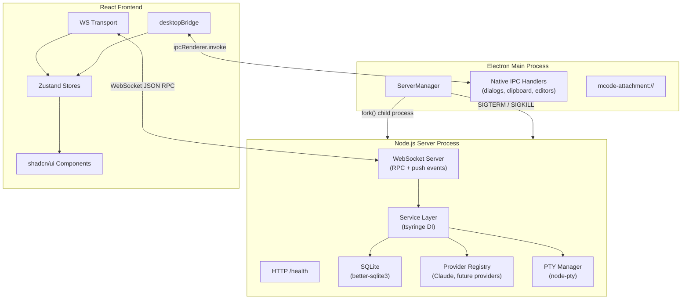
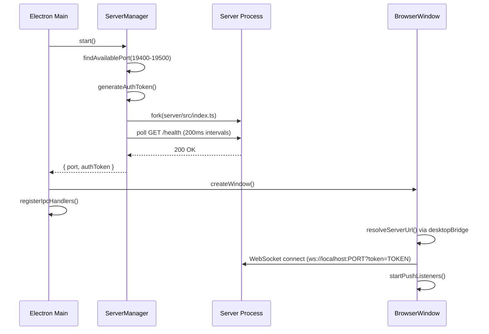
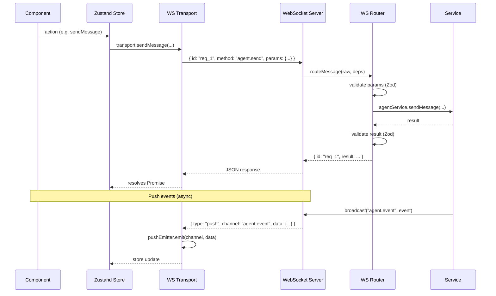
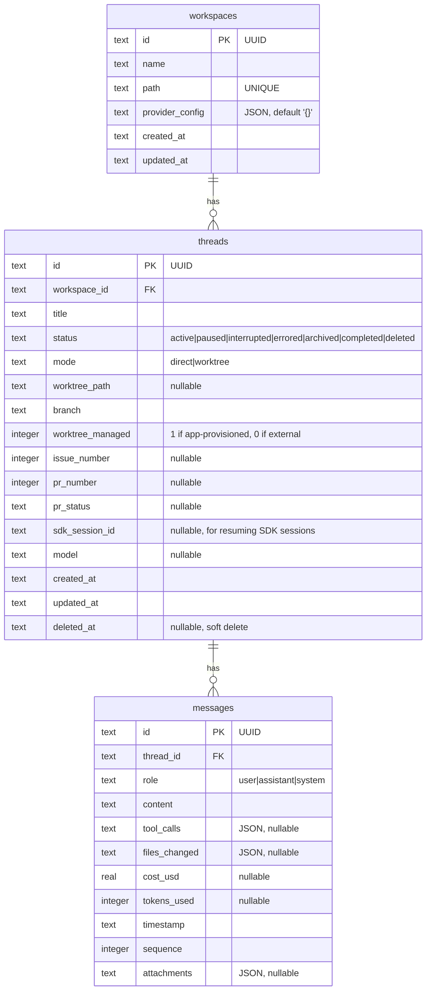
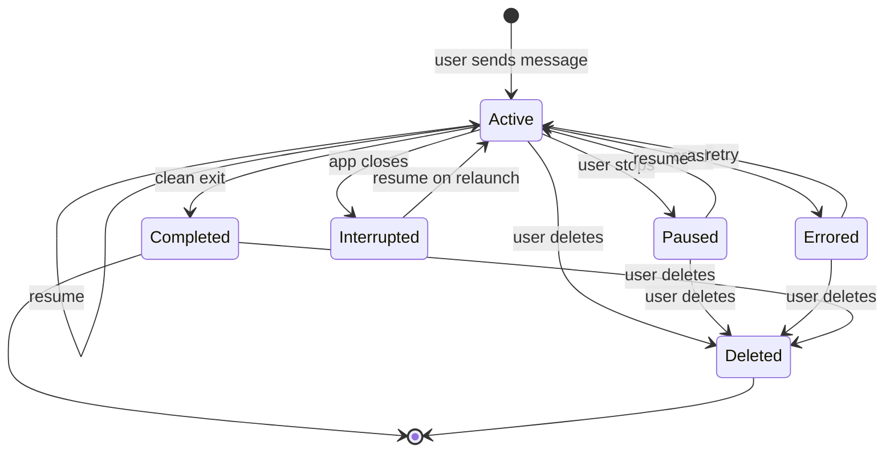
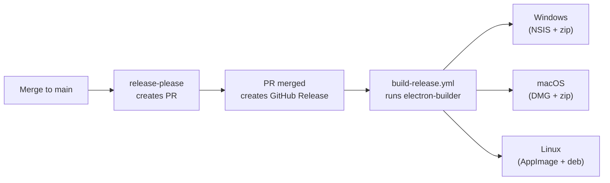

# Architecture

## 1. Overview

Mcode is a desktop app for orchestrating AI coding agents. It manages multiple agent sessions across git repositories, with each thread optionally running in its own git worktree for branch isolation.

The codebase is split into four layers: a **contracts** package (shared types and Zod schemas), a **shared** package (runtime utilities), a standalone **server** (all business logic), and a thin **desktop** shell (Electron, native OS bridging). The React frontend connects to the server over WebSocket and uses Electron IPC only for native-only features like file dialogs and clipboard access.

Key architectural rules:

- `server` has zero Electron imports. Pure Node.js.
- `desktop` has zero business logic. It cannot read the database or manage agents.
- `web` never imports from `server` or `desktop`. It depends only on `contracts`.
- `contracts` has zero runtime dependencies. Types and Zod schemas only.

## 2. Tech Stack

| Layer | Technology |
|-------|------------|
| Runtime | Bun (package manager + script runner) |
| Monorepo | Turborepo |
| Desktop | Electron 35, esbuild (main/preload) + Vite (renderer) |
| Server | Node.js, tsyringe (DI), better-sqlite3, Claude Agent SDK |
| Frontend | React 19, Vite, shadcn/ui, Tailwind CSS 4, Zustand |
| Contracts | Zod (schemas + type inference) |
| Database | SQLite (WAL mode, better-sqlite3) |
| Communication | WebSocket (JSON RPC + push events) |
| Testing | Vitest (unit), Playwright (E2E) |
| CI/CD | GitHub Actions, release-please, electron-builder |

## 3. Package Structure

```text
packages/
  contracts/                    Single source of truth for types and schemas
  shared/                       Runtime utilities used across packages

apps/
  server/                       Standalone Node.js HTTP + WebSocket server
  web/                          React SPA (connects via WebSocket)
  desktop/                      Thin Electron shell (~500 lines)
```

### Package Dependency Graph

```text
contracts (zero runtime deps)
    |
    +--> shared (depends on contracts)
    |       |
    |       +--> server (depends on contracts + shared)
    |       +--> desktop (depends on contracts + shared)
    |
    +--> web (depends on contracts only)
```

### packages/contracts

Single source of truth for all shared types, replacing manual duplication between packages. Uses Zod schemas that serve as both TypeScript types (via `z.infer`) and runtime validators at the WebSocket boundary.

```text
packages/contracts/src/
  index.ts                    Barrel re-export
  models/
    workspace.ts              Workspace schema + type
    thread.ts                 Thread schema + type
    message.ts                Message schema + type
    attachment.ts             AttachmentMeta, StoredAttachment
    enums.ts                  ThreadStatus, ThreadMode, MessageRole, PermissionMode, InteractionMode
  events/
    agent-event.ts            AgentEvent discriminated union (Zod)
  ws/
    methods.ts                WS_METHODS: RPC method definitions (params + result schemas)
    channels.ts               WS_CHANNELS: push channel definitions
    protocol.ts               WebSocketRequest, WebSocketResponse, WsPush types
  providers/
    interfaces.ts             IAgentProvider, IProviderRegistry, ProviderId
  git.ts                      GitBranch, WorktreeInfo schemas
  github.ts                   PrInfo, PrDetail schemas
  skills.ts                   SkillInfo schema
```

### packages/shared

Runtime utilities used by multiple packages:

```text
packages/shared/src/
  logging/                    Rotating file logger (Winston + daily rotation)
  paths/                      Mcode data directory resolution (from MCODE_DATA_DIR env)
  git/                        Branch name sanitization, validation helpers
```

### apps/server

Standalone Node.js process. Owns all business logic: database, AI providers, git operations, PTY management, and file serving.

```text
apps/server/src/
  index.ts                    HTTP + WebSocket server entry point
  container.ts                tsyringe composition root
  services/
    agent-service.ts          Agent session orchestration, event forwarding
    workspace-service.ts      Workspace CRUD
    thread-service.ts         Thread lifecycle, worktree provisioning
    git-service.ts            Branch, worktree, checkout, fetch operations
    github-service.ts         PR operations via gh CLI
    file-service.ts           File listing (git ls-files), reading
    config-service.ts         Claude config discovery (~/.claude/)
    skill-service.ts          Skill scanning from filesystem
    terminal-service.ts       PTY management (node-pty)
    attachment-service.ts     Persist/read attachments
  providers/
    provider-registry.ts      Resolves provider by ID, injects all registered providers
    claude/
      claude-provider.ts      Claude Agent SDK adapter (prompt queue pattern)
  repositories/
    workspace-repo.ts         Workspace data access
    thread-repo.ts            Thread data access
    message-repo.ts           Message data access
  store/
    database.ts               SQLite setup, WAL mode, forward-only migrations
  transport/
    ws-server.ts              HTTP + WebSocket server, auth token validation
    ws-router.ts              Method string to service dispatch, Zod validation
    push.ts                   Broadcast push events to all connected clients
```

### apps/web

React SPA. All business logic calls go through the WebSocket transport. Native desktop features (dialogs, clipboard, editors) use `window.desktopBridge` when running inside Electron.

```text
apps/web/src/
  transport/
    index.ts                  Factory: resolves server URL, creates WS transport
    ws-transport.ts           WebSocket RPC client + push event emitter + reconnection
    ws-events.ts              Push channel listener setup (agent, terminal, file, thread events)
    desktop-bridge.d.ts       Type declarations for window.desktopBridge
    types.ts                  McodeTransport interface, shared frontend types
  app/                        Routes and providers
  components/                 UI components (sidebar, chat, terminal, diff)
  stores/                     Zustand state management
  lib/                        Utilities and types
```

### apps/desktop

Thin Electron shell. Spawns the server, creates the BrowserWindow, and bridges native OS features via IPC. No business logic.

```text
apps/desktop/src/main/
  main.ts                     Window creation, server spawn, native IPC handlers, lifecycle
  preload.ts                  contextBridge: desktopBridge + getPathForFile
  server-manager.ts           Child process lifecycle (spawn, health poll, restart, shutdown)
```

## 4. Communication Flow



### Startup Sequence



### RPC Call Flow



## 5. Data Layer

### 5.1 Schema



All model types are defined as Zod schemas in `packages/contracts` and inferred via `z.infer`. The server validates data at the WebSocket boundary (both params and results) so the frontend receives typed, validated payloads.

### 5.2 Migrations

Forward-only migrations are applied on startup by `database.ts` using a `_migrations` tracking table. Current migrations:

| Version | Change | Location |
|---------|--------|----------|
| V001 | Initial schema (workspaces, threads, messages, indexes) | Inline SQL in `database.ts` |
| V002 | Add `model` column to threads | Inline |
| V003 | Add `worktree_managed` column to threads | Inline |
| V004 | Add `attachments` column to messages | Inline |
| V005 | Add `sdk_session_id` column to threads | Inline |
| V006 | Drop legacy `pid` and `session_name` columns from threads | Inline |

### 5.3 Repository Pattern

Each entity has a dedicated repo class (`WorkspaceRepo`, `ThreadRepo`, `MessageRepo`). Repos accept a `Database` instance via constructor injection and return typed objects. Services depend on repos through DI; no module reads the database directly.

## 6. WebSocket RPC Protocol

### 6.1 Message Formats

**Request (client to server):**

```typescript
{ id: "req_1", method: "thread.create", params: { workspaceId: "...", title: "...", mode: "direct", branch: "main" } }
```

**Response (success):**

```typescript
{ id: "req_1", result: { id: "...", title: "...", status: "active", ... } }
```

**Response (error):**

```typescript
{ id: "req_1", error: { code: "NOT_FOUND", message: "Workspace not found" } }
```

**Push (server to client, no request ID):**

```typescript
{ type: "push", channel: "agent.event", data: { threadId: "abc", type: "toolUse", ... } }
```

### 6.2 RPC Methods

All params and results are defined as Zod schemas in `packages/contracts/src/ws/methods.ts`. The router validates both directions at runtime.

| Method | Description |
|--------|-------------|
| `workspace.list` | List all workspaces |
| `workspace.create` | Create a workspace (name + path) |
| `workspace.delete` | Delete a workspace by ID |
| `thread.list` | List threads for a workspace |
| `thread.create` | Create a thread (workspace, title, mode, branch) |
| `thread.delete` | Delete a thread, optionally cleaning up its worktree |
| `thread.updateTitle` | Rename a thread |
| `thread.markViewed` | Clear the "completed" badge on a thread |
| `git.listBranches` | List branches for a workspace |
| `git.currentBranch` | Get the current branch |
| `git.checkout` | Switch branches |
| `git.listWorktrees` | List git worktrees |
| `git.fetchBranch` | Fetch a branch (optionally for a PR) |
| `agent.send` | Send a message to an existing thread's agent |
| `agent.createAndSend` | Create a thread and send a message in one call |
| `agent.stop` | Stop an active agent session |
| `agent.activeCount` | Get the number of active agent sessions |
| `agent.listRunning` | List thread IDs with live agent sessions. Called on WS (re)connect to hydrate `runningThreadIds`. |
| `message.list` | Load messages for a thread |
| `file.list` | List files in a workspace (uses `git ls-files`) |
| `file.read` | Read a file by relative path |
| `github.branchPr` | Get PR info for a branch |
| `github.listOpenPrs` | List open PRs for a workspace |
| `github.prByUrl` | Look up a PR by URL |
| `config.discover` | Discover Claude config for a workspace path |
| `skill.list` | List available skills |
| `terminal.create` | Create a PTY for a thread |
| `terminal.write` | Write data to a PTY |
| `terminal.resize` | Resize a PTY |
| `terminal.kill` | Kill a PTY |
| `terminal.killByThread` | Kill all PTYs for a thread |
| `app.version` | Get the server version |

### 6.3 Push Channels

Push events are broadcast to all connected WebSocket clients. The server validates push data against channel schemas before sending.

| Channel | Data | Description |
|---------|------|-------------|
| `agent.event` | `AgentEvent` | Agent stream events (message, toolUse, toolResult, turnComplete, error, ended, system) |
| `terminal.data` | `{ ptyId, data }` | PTY output |
| `terminal.exit` | `{ ptyId, code }` | PTY exited |
| `thread.status` | `{ threadId, status }` | Thread status changed |
| `files.changed` | `{ workspaceId, threadId? }` | File list invalidated (after agent turns) |
| `skills.changed` | `{}` | Skill list invalidated |

**Note:** `thread.status` reports persistent DB states (`active` / `completed` / `errored`). Live-session state (agent is running right now) is conveyed via the `turnStarted` / `turnComplete` / `ended` AgentEvents and the `agent.listRunning` RPC, not via this channel.

### 6.4 Authentication

The server accepts a token via the WebSocket URL query parameter. The desktop shell generates a random UUID token on each launch and passes it to both the server (via env) and the renderer (via the `desktopBridge.getServerUrl()` IPC call).

```
ws://localhost:19432?token=<uuid>
```

Connections without a valid token are closed with code `4001 Unauthorized`.

### 6.5 Agent Events

Events emitted by agent providers and broadcast on the `agent.event` push channel:

| Event | Fields | Description |
|-------|--------|-------------|
| `message` | `threadId, content, tokens` | Complete assistant message |
| `toolUse` | `threadId, toolCallId, toolName, toolInput` | Tool invocation |
| `toolResult` | `threadId, toolCallId, output, isError` | Tool output |
| `turnStarted` | `threadId` | Emitted at the start of a new turn before any other events. Mirrors `turnComplete` and `ended`. |
| `turnComplete` | `threadId, reason, costUsd, tokensIn, tokensOut` | Turn finished with cost and token counts |
| `error` | `threadId, error` | Agent error |
| `ended` | `threadId` | Session fully terminated |
| `system` | `threadId, subtype` | System-level notification |

## 7. Service Layer and Dependency Injection

### 7.1 Composition Root

The server uses tsyringe for dependency injection. All services, repositories, and providers are registered as singletons in `apps/server/src/container.ts`.

```typescript
// Simplified registration flow:
container.register("Database", { useValue: openDatabase() });
container.register(WorkspaceRepo, { useClass: WorkspaceRepo }, { lifecycle: Lifecycle.Singleton });
container.register(ClaudeProvider, { useClass: ClaudeProvider }, { lifecycle: Lifecycle.Singleton });
container.register("IAgentProvider", { useFactory: (c) => c.resolve(ClaudeProvider) });
container.register(ProviderRegistry, { useClass: ProviderRegistry }, { lifecycle: Lifecycle.Singleton });
container.register(AgentService, { useClass: AgentService }, { lifecycle: Lifecycle.Singleton });
// ... all other services
```

### 7.2 Layer Responsibilities

| Layer | Responsibility | Example |
|-------|---------------|---------|
| Transport | WebSocket RPC routing, Zod validation, push broadcasting | `ws-router.ts`, `push.ts` |
| Service | Business logic, orchestration, session management | `AgentService`, `ThreadService` |
| Repository | Data access, SQL queries, row-to-object mapping | `ThreadRepo`, `MessageRepo` |
| Provider | External service adapters (AI, git, GitHub) | `ClaudeProvider`, `GitService` |
| Store | SQLite schema, migrations, connection setup | `database.ts` |

Services depend on repositories and providers via constructor injection. No service imports another service's implementation directly.

### 7.3 Request Validation

The WebSocket router (`ws-router.ts`) performs three-phase validation for every RPC call:

1. **Parse**: Validate the raw message against `WebSocketRequestSchema` (must have `id`, `method`, `params`)
2. **Params**: Validate `params` against the method's Zod schema from `WS_METHODS`
3. **Result**: Validate the service return value against the method's result schema (logs warnings on mismatch but does not block the response)

## 8. Provider Registry

### 8.1 Provider Interface

The `IAgentProvider` interface in `packages/contracts` defines the contract for AI agent backends:

```typescript
type ProviderId = "claude" | "codex" | "gemini" | "copilot";

interface IAgentProvider {
  readonly id: ProviderId;
  sendMessage(params: { sessionId, message, cwd, model, resume, permissionMode, attachments? }): void;
  stopSession(sessionId: string): void;
  setSdkSessionId(sessionId: string, sdkSessionId: string): void;
  shutdown(): void;
  on(event: "event", handler: (event: AgentEvent) => void): void;
  on(event: "error", handler: (error: Error) => void): void;
}
```

### 8.2 Registry Pattern

`ProviderRegistry` collects all registered `IAgentProvider` tokens via tsyringe's `@injectAll` decorator, indexes them by `ProviderId`, and exposes `resolve(id)` and `resolveAll()`. Adding a new provider requires only registering its class in the DI container.

### 8.3 Claude Provider (Session Architecture)

The Claude provider preserves the prompt queue pattern:

- `query()` is called once per session with an `AsyncIterable<SDKUserMessage>`
- Messages pushed to the queue feed the existing subprocess without cold-starting
- MCP servers, context, and session state persist across turns
- Session pool with idle eviction (10-minute TTL)
- Resume with `sdk_session_id` after app restart, fallback to fresh query on failure

The server process is long-lived (spawned once by desktop, lives until app closes), so the session pool persists naturally.

### 8.4 Codex Provider (Session Architecture)

The Codex provider (`apps/server/src/providers/codex/`) uses one persistent `codex app-server` child process per session, communicating via JSON-RPC 2.0 over stdin/stdout (NDJSON):

- `codex-provider.ts` - `IAgentProvider` implementation; manages `CodexAppServer` sessions
- `codex-app-server.ts` - persistent child process lifecycle manager
- `codex-rpc-client.ts` - JSON-RPC 2.0 NDJSON client (line buffering, request/response correlation)
- `codex-event-mapper.ts` - maps Codex JSON-RPC notifications to `AgentEvent` objects
- `codex-version.ts` - CLI version gate (rejects CLI < 0.37.0)
- `codex-types.ts` - JSON-RPC protocol type definitions

Lifecycle per session:

1. **Handshake**: `initialize` → `initialized` → `model/list` (best-effort) → `thread/start` (or `thread/resume` with fresh-thread fallback)
2. **Turn**: `turn/start` RPC, events stream via notifications, wait for `turn.completed` / `turn.failed`
3. **Cancel**: `turn/interrupt` RPC, then `taskkill /T /F` on Windows (full tree kill)
4. **Eviction**: sessions idle for 10 minutes have their child process killed

On Windows, `shell: true` on spawn resolves `.cmd` shims. Process tree kill uses `taskkill /T /F /PID` because Node's `child.kill()` does not kill grandchildren.

## 9. Desktop Shell

### 9.1 ServerManager

`ServerManager` in `apps/desktop/src/main/server-manager.ts` handles the server child process lifecycle:

1. **Port discovery**: Scans ports 19400-19500 for an available TCP port
2. **Spawn**: Forks the server entry point with `ELECTRON_RUN_AS_NODE=1` and passes port, auth token, data directory, and version via environment variables
3. **Health polling**: Polls `GET /health` every 200ms until the server responds 200 (10s timeout)
4. **Shutdown**: Sends SIGTERM, then SIGKILL after a 5-second grace period
5. **Restart**: Kills the current process, waits 500ms for port release, then spawns a fresh instance

### 9.2 Native IPC (desktopBridge)

The preload script exposes `window.desktopBridge` for operations that require native Electron APIs. These are the only things that use Electron IPC:

| Method | Purpose |
|--------|---------|
| `getServerUrl()` | Get the WebSocket URL with auth token |
| `showOpenDialog(options)` | Native folder picker dialog |
| `openInEditor(editor, path)` | Launch VS Code, Cursor, or Zed |
| `openInExplorer(path)` | Open in system file explorer |
| `openExternalUrl(url)` | Open URL in default browser (https only) |
| `detectEditors()` | Scan for installed editors |
| `readClipboardImage()` | Read image from clipboard, save as temp JPEG |
| `getLogPath()` | Get the log directory path |
| `getRecentLogs(lines)` | Read recent log lines |
| `getPathForFile(file)` | Resolve native path for a drag-and-drop File object |

### 9.3 Attachment Protocol

The desktop shell registers a custom `mcode-attachment://` protocol for inline display of stored attachments. Requests are routed as `mcode-attachment://THREAD_ID/ATTACHMENT_ID.EXT` and served directly from the user data directory with immutable caching headers.

### 9.4 Graceful Shutdown

On close, the desktop shell checks the server's active agent count via the `/health` endpoint. If agents are running, a confirmation dialog warns the user. On confirmation (or if no agents are active), the shell sends SIGTERM to the server process.

The server handles SIGTERM with a five-step shutdown sequence:

1. Stop all active agent sessions
2. Shut down all providers (closes SDK subprocesses)
3. Mark active threads as "interrupted" in the database
4. Shut down the terminal service (kills all PTYs)
5. Close the database connection

## 10. Web Transport Layer

### 10.1 Transport Initialization

The transport factory in `apps/web/src/transport/index.ts` resolves the server URL and creates a single WebSocket connection:

1. In Electron: calls `window.desktopBridge.getServerUrl()` to get the authenticated URL
2. In standalone/dev mode: falls back to `VITE_SERVER_URL` env var or `ws://localhost:3100`

`initTransport()` is called once at app startup. `getTransport()` returns the instance synchronously for use in stores and components.

### 10.2 WebSocket Transport

`ws-transport.ts` implements the `McodeTransport` interface where every method maps to a single `rpc()` call matching the server's `WS_METHODS` names. Server push messages are forwarded to a shared `PushEmitter` instance.

### 10.3 Reconnection

The WebSocket transport includes automatic reconnection:

- Exponential backoff: 1s, 2s, 4s, 8s, up to 30s max
- All pending RPC calls are rejected with "WebSocket disconnected" on close
- Push channel listeners persist across reconnects (they live on the `PushEmitter`, not the WebSocket)
- Connection readiness is tracked with a resettable Promise that gates `rpc()` calls

### 10.4 Push Event Listeners

`ws-events.ts` wires push channels to the appropriate Zustand stores:

| Channel | Handler |
|---------|---------|
| `agent.event` | Forwards to `threadStore.handleAgentEvent()` |
| `terminal.data` | Dispatches `mcode:pty-data` CustomEvent for xterm instances |
| `terminal.exit` | Dispatches `mcode:pty-exit` CustomEvent, removes terminal after delay |
| `thread.status` | Updates thread status in `workspaceStore` |
| `files.changed` | Clears the file autocomplete cache for the workspace |
| `skills.changed` | Reserved for future skill cache invalidation |

## 11. Session Lifecycle



## 12. Frontend Architecture

| Concern | Technology |
|---------|------------|
| Components | shadcn/ui primitives + custom components |
| Styling | Tailwind CSS 4 + CVA + tailwind-merge |
| State | Zustand stores (workspaceStore, threadStore, settingsStore) |
| Routing | TanStack Router |
| Virtualization | @tanstack/react-virtual |
| Icons | Lucide React |
| Markdown | react-markdown + remark-gfm |

## 13. Development Setup

**Prerequisites:** Bun, Git, Claude Code CLI on PATH.

```bash
git clone <repo-url>
cd mcode
bash scripts/setup-env.sh
bun install

# Run the full Electron app (main + renderer)
bun run dev:desktop

# Run the frontend only (connects to localhost:3100 or VITE_SERVER_URL)
bun run dev:web
```

## 14. Testing

| Type | Command | Framework |
|------|---------|-----------|
| Unit | `bun run test` | Vitest |
| E2E | `cd apps/web && bun run e2e` | Playwright |
| E2E (headed) | `cd apps/web && bun run e2e:headed` | Playwright |

E2E tests save screenshots to `apps/web/e2e/screenshots/` for visual verification.

## 15. Performance Budgets

| Metric | Target |
|--------|--------|
| App idle memory | < 150 MB |
| Max concurrent agents | 5 (configurable) |
| First 100 messages load | < 50 ms |
| App startup to usable | < 2 seconds |
| Frontend bundle size | < 2 MB gzipped |
| Server heap limit | 512 MB (configurable via `server.memory.heapMb`) |

## 16. CI/CD and Release

### CI Jobs (on pull request)

| Job | What it does |
|-----|-------------|
| `pr-title` | Validates conventional commit format |
| `lint-desktop` | Typechecks `apps/desktop` |
| `lint-frontend` | Runs ESLint + typecheck on `apps/web` |
| `test-frontend` | Runs Vitest on `apps/web` |
| `build-check` | Builds both packages |

All CI jobs use `oven-sh/setup-bun@v2`, Bun 1.2.14, and `bun install --frozen-lockfile`.

### Release Pipeline


