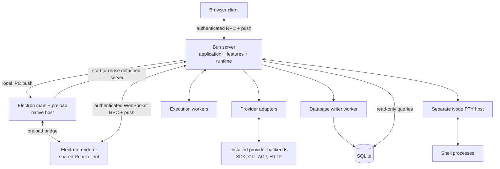
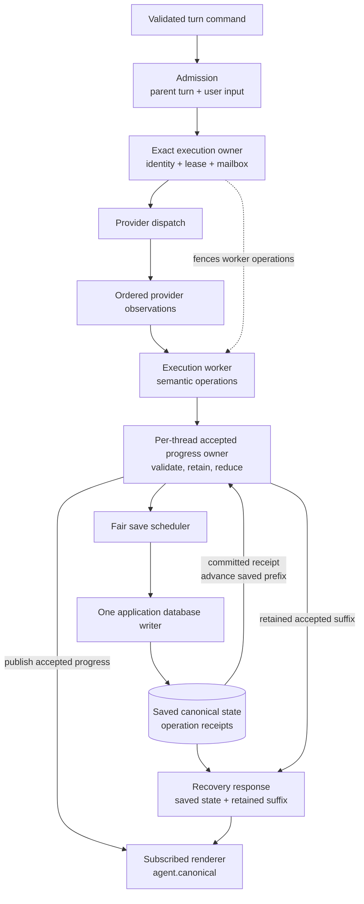

# Architecture

## Overview

Mcode is a local-first desktop application for running coding agents against local projects and Git worktrees. The Electron desktop app and browser app share one React client. A separate Bun server owns agent orchestration, durable conversation state, project operations, and terminal sessions.

Provider adapters translate external protocols into Mcode's canonical agent model. Execution workers process ordered observations. A separate progress owner publishes accepted progress and schedules persistence through one database writer. This separation lets the conversation update while saving continues, with explicit limits on what recovery can preserve.

The [domain glossary](CONTEXT.md) defines product terms. The architecture below describes ownership and data flow rather than every method or database field.

```mermaid
flowchart TD
    Browser["Browser client"]
    Renderer["Electron renderer<br/>shared React client"]
    Desktop["Electron main + preload<br/>native host"]
    Server["Bun server<br/>application + features + runtime"]
    Adapters["Provider adapters"]
    Backends["Installed provider backends<br/>SDK, CLI, ACP, HTTP"]
    Workers["Execution workers"]
    Writer["Database writer worker"]
    DB[("SQLite")]
    PTY["Separate Node PTY host"]
    Shells["Shell processes"]

    Desktop -->|"start or reuse detached server"| Server
    Browser <-->|"authenticated RPC + push"| Server
    Renderer <-->|"authenticated WebSocket RPC + push"| Server
    Server -->|"local IPC push"| Desktop
    Desktop <-->|"preload bridge"| Renderer
    Server --> Adapters
    Adapters <--> Backends
    Server <--> Workers
    Server --> Writer
    Writer --> DB
    Server -->|"read-only queries"| DB
    Server <--> PTY
    PTY <--> Shells
```

## Package boundaries

The packages separate the shared domain model from application services and external protocols.

| Area | Ownership |
|---|---|
| [`packages/agent-model`](packages/agent-model/src/index.ts) | Provider-neutral identities, capabilities, events, records, and reducers. |
| [`packages/contracts`](packages/contracts/src/index.ts) | Runtime schemas, RPC and push contracts, provider interfaces, and shared application types. |
| [`packages/shared`](packages/shared/package.json) | Shared utilities with separate browser-safe and Node entry points. |
| [`packages/thread-orchestration`](packages/thread-orchestration/src/index.ts) | Pure thread-control authorities, scopes, lineage, and instruction planning. |
| [`packages/providers`](packages/providers/src/index.ts) | Provider factories, private transports, protocol mapping, and injected host ports. |
| [`apps/server`](apps/server/src/index.ts) | Application composition, feature services, execution, persistence, and runtime ownership. |
| [`apps/web`](apps/web/src/app/App.tsx) | Shared renderer, navigation, conversation projection, and browser and terminal presentation. |
| [`apps/desktop`](apps/desktop/src/main/main.ts) | Native windows, preload IPC, server supervision, updates, browser security, and desktop integration. |

`thread-orchestration` does not own the server's execution workers or database. Its pure rules support the application services that do.

The renderer imports contracts and browser-safe shared code. It does not import server or desktop implementation. Contracts do not import applications or provider implementations. These boundaries are enforced in [`.dependency-cruiser.cjs`](.dependency-cruiser.cjs).

`packages/browser-conformance` and `packages/oxlint-plugin` support verification and repository checks. They are tooling rather than application runtime layers.

## Server ownership

The server entry point leads to the [application bootstrap](apps/server/src/application/bootstrap/server-bootstrap.ts), which composes repositories, services, provider registrations, transports, and shutdown coordination.

The source tree has three main responsibilities:

- [`application`](apps/server/src/application) owns composition and shared RPC, HTTP, WebSocket, and IPC transport.
- [`features`](apps/server/src/features) owns domain services and repositories, including agents, projects, thread control, providers, handoff, review, browser automation, and terminals.
- [`runtime`](apps/server/src/runtime) owns SQLite infrastructure, environment handling, process containment, lifecycle, diagnostics, and memory policy.

Feature transport handlers translate requests into service calls. Feature services coordinate domain work. Repositories read saved state and submit named write operations to the database owner.

[`AgentService`](apps/server/src/features/agents/orchestration/agent-service.ts) is an entry point for agent commands. [`TurnRuntimeController`](apps/server/src/features/agents/orchestration/turn-runtime-controller.ts) owns active turn coordination. Neither should be treated as the entire event-processing or persistence system.

The [memory pressure service](apps/server/src/runtime/memory/memory-pressure-service.ts) measures runtime memory against a soft budget and asks consumers to shed disposable state. Memory pressure does not block new turns.

## Commands and client transport

[`initTransport`](apps/web/src/transport/index.ts) creates the client transport and resolves the server connection. Electron supplies an authenticated connection through its preload bridge. A worktree runtime uses its runtime contract to keep the client paired with the correct server.

Application commands use typed WebSocket RPC. The [router](apps/server/src/application/transport/ws-router.ts) validates the request envelope and method parameters before calling the registered handler. A successful `agent.send` acknowledges turn admission. It does not mean that the provider has completed the turn.

Ordinary outgoing RPC results and push payloads use a [development validation adapter](apps/server/src/application/transport/payload-validation.ts). Production uses a pass-through adapter. In development, an invalid RPC result logs a warning, while an invalid ordinary push is withheld. This policy is separate from validation at untrusted input boundaries and canonical event processing.

HTTP and WebSocket authentication use a token stored with the server's data directory, or an environment override. The [token extractor](apps/server/src/application/transport/auth.ts) accepts a Bearer header, a query token, or the `mcode-auth` cookie. Worktree instance pairing also checks the runtime's instance token and worktree identity.

The [push layer](apps/server/src/application/transport/push.ts) scopes canonical progress, saving status, turn file effects, and turn diff updates to subscribed threads. Other channels have their own delivery rules.

Electron can also receive push through a local named pipe or Unix socket. Desktop main relays that stream through preload to the renderer's common push emitter. The [IPC client](apps/web/src/transport/ipc-push-client.ts) suppresses duplicate WebSocket delivery for channels covered by IPC and restores WebSocket delivery if IPC disconnects. RPC still uses WebSocket.

Terminal output has a binary WebSocket protocol. The alternate IPC path represents terminal bytes as base64. Renderer terminal callbacks use the [PTY data registry](apps/web/src/features/terminal/adapters/pty-data-registry.ts).

The [WebSocket transport](apps/web/src/transport/ws-transport.ts) handles reconnection and half-open connection detection. Reconnection refreshes runtime state, restores subscriptions, and revalidates the selected conversation. Reconnecting transport does not itself recreate a provider turn.

## Turn admission and progress

Turn admission and provider observation have different owners.

The [admission coordinator](apps/server/src/features/agents/turns/turn-admission-dispatch-coordinator.ts) checks the thread, provider, checkout, permissions, attachments, and command effects. It records the parent turn and user input before provider dispatch, with an exact thread, turn, and execution identity.

User-dispatched executions use [`WorkerOwnedTurnRuntime`](apps/server/src/features/agents/execution/worker-owned-turn-runtime.ts) when the worker owner is bound. This path applies across providers. The runtime assigns an execution lease and mailbox to a worker in a bounded pool. Ownership checks prevent a stale worker or late observation from acting on a replacement execution.

Provider-originated continuation can still enter the legacy provider ingress and turn pipeline. The worker-owned path must not be assumed to cover every adapter callback or recovery route.

```mermaid
flowchart TD
    Command["Validated turn command"]
    Admission["Admission<br/>parent turn + user input"]
    Owner["Exact execution owner<br/>identity + lease + mailbox"]
    Provider["Provider dispatch"]
    Observations["Ordered provider observations"]
    Worker["Execution worker<br/>semantic operations"]
    Progress["Per-thread accepted progress owner<br/>validate, retain, reduce"]
    Client["Subscribed renderer<br/>agent.canonical"]
    Fair["Fair save scheduler"]
    Writer["One application database writer"]
    Saved[("Saved canonical state<br/>operation receipts")]
    Recovery["Recovery response<br/>saved state + retained suffix"]

    Command --> Admission --> Owner --> Provider
    Provider --> Observations --> Worker --> Progress
    Owner -.->|"fences worker operations"| Worker
    Progress -->|"publish accepted progress"| Client
    Progress --> Fair --> Writer --> Saved
    Saved -->|"committed receipt<br/>advance saved prefix"| Progress
    Saved --> Recovery
    Progress -->|"retained accepted suffix"| Recovery
    Recovery --> Client
```

[`CanonicalAcceptedProgress`](apps/server/src/features/agents/canonical/canonical-accepted-progress.ts) owns accepted progress independently of execution workers. It validates and retains immutable operations, reduces the canonical model, and publishes `agent.canonical` before those operations finish saving.

Accepted progress means that the running server owns the operation and its replay data. It does not mean that SQLite has committed it.

The [save scheduler](apps/server/src/features/agents/canonical/accepted-save-scheduler.ts) runs one ready batch per thread before returning to a busy thread. Saved receipts advance only the contiguous saved prefix. Failed or pending operations remain in the retained suffix rather than being reported as saved.

Execution state and saving state are separate. A provider can finish while progress is still saving. Commands that require durable state must wait behind the retained suffix instead of overtaking it.

Recovery combines saved canonical state with the retained accepted suffix. The suffix can survive execution worker release or loss because the progress owner is separate. It cannot survive a server process crash. Recovery reports detected loss instead of inventing missing progress. Saved acknowledgements and recovery rebuild state without replaying provider commands or first-delivery renderer effects.

The [accepted progress and saving constraints](docs/internals/conversation/narrative-pipeline.md#accepted-progress-and-saving) explain the ownership rules that span these stages.

## Persistence and write outcomes

The [SQLite schema](apps/server/src/runtime/persistence/sqlite/schema.ts) stores workspace, thread, conversation, and feature records. Canonical agent tables represent threads, turns, items, events, checkpoints, and operation receipts. Compatibility projections support existing message and narrative readers.

Runtime repositories use a [physically read-only SQLite connection](apps/server/src/runtime/persistence/sqlite/read-only-database.ts). The [`ApplicationDatabaseWriter`](apps/server/src/runtime/persistence/sqlite/application-database-writer.ts) owns the server process's writable runtime connection in a worker. Ordinary mutations and canonical writes share bounded admission. Write transactions execute in that worker.

Canonical operations carry stable identities and persisted receipts. If a writer reply is lost, receipt-backed recovery can distinguish a committed operation from work that still needs application.

An ordinary mutation whose worker disappears after dispatch has an unknown outcome. It may already have committed. The writer reports `DatabaseWriteOutcomeUnknown` and does not automatically replay the mutation. Callers must preserve that uncertainty.

Migrations use the SQL files and journal in [`apps/server/drizzle`](apps/server/drizzle). [Database initialization](apps/server/src/runtime/persistence/sqlite/database.ts) also reconciles legacy migration history and applies compatibility repairs. Migration backup and restoration belong to startup initialization, not ordinary replacement-writer recovery.

Global user settings live in `settings.json` under the data directory through [`SettingsService`](apps/server/src/features/settings/settings-service.ts).

The [migration guide](docs/internals/persistence/db-migrations.md) defines the maintained schema-change workflow.

## Provider boundaries

The shared [`IAgentProvider` interface](packages/contracts/src/providers/interfaces.ts) accepts a `TurnRequest` through `sendTurn`. It exposes runtime events, stop and shutdown operations, model discovery, and capability-specific extensions. Provider descriptors let callers make explicit capability decisions before dispatch.

The registered runtime implementations are split between two locations:

- Claude, Codex, Copilot, Cursor, and Devin implementations live privately in [`packages/providers`](packages/providers/src/private) and enter the server through usable public factories.
- OpenCode remains in [`server-local adapters`](apps/server/src/features/providers/adapters).

The OpenCode factory resolves the server-local `OpenCodeProvider`, a usable runtime adapter. Gemini is a coming-soon catalog entry.

The six registered providers use different transports.

| Provider | External transport |
|---|---|
| Claude | Claude Agent SDK query with a prompt queue. |
| Codex | Persistent app-server process with NDJSON JSON-RPC. |
| Copilot | Copilot SDK session callbacks and sends. |
| Cursor | `agent acp` through the shared ACP implementation. |
| Devin | `devin acp` through the shared ACP implementation. |
| OpenCode | Pooled `opencode serve` processes with HTTP requests and SSE events. |

Providers implemented in `packages/providers` receive server authority through [`ProviderHostPorts`](packages/providers/src/host-ports.ts). The [server host adapter](apps/server/src/features/providers/composition/provider-host-ports.ts) supplies environment, process containment, browser access, thread control, grants, and canonical event submission. Providers do not own the application database.

`SessionRuntime` supplies pooling and lifecycle support for adapters that use it. It is not a universal transport design. OpenCode owns an `OpenCodeServerPool`, and process lifetime does not have a universal one-session-to-one-process relationship.

Resume, stop, eviction, and recovery remain provider-specific. A healthy Codex process can remain warm after Stop. Cursor and Devin reject a failed persisted-session recovery rather than silently replacing the session. Shared interfaces do not establish identical recovery guarantees.

The [provider architecture guide](docs/internals/providers/provider-architecture.md) explains adapter rules and transport-specific constraints.

## Renderer and native responsibilities

The renderer owns interaction state and presentation. It uses React, Zustand, and virtualized conversation rendering. Primary navigation uses [`AppPrimarySurface` in `App.tsx`](apps/web/src/app/App.tsx) and navigation history state.

[`threadStore`](apps/web/src/stores/threadStore.ts) projects validated canonical progress into conversation records. The [conversation residency owner](apps/web/src/features/conversation/residency/conversation-residency.ts) coordinates selected activation, revalidation, prefetch, pagination, and bounded inactive retention. Sidebar workspace state owns selection and summary rows. It is not a second conversation cache authority.

The application mounts browser and terminal hosts outside individual panel lifetimes. Switching panels therefore does not inherently destroy the underlying page or terminal.

[`BrowserSurfaceHost`](apps/web/src/features/preview/browser-surfaces/BrowserSurfaceHost.ts) owns renderer page placement, visibility, and semantic state. Electron pages use renderer-owned webviews. Browser clients use iframes. Browser automation has its own renderer host and server coordination.

The [desktop preview feature](apps/desktop/src/features/preview/index.ts) owns native adoption, navigation, permissions, capture, and automation checks. Generation-bound identities prevent stale page commands from controlling a replacement page. Guest security policy disables Node integration and uses context isolation, sandboxing, and controlled partitions.

The [Browser security boundaries](docs/internals/runtime/browser-v2-rollout.md#security-boundaries) explain shared session state and the main-process checks that govern guest permissions.

Electron main is a substantial native host. Its [preload bridge](apps/desktop/src/main/preload.ts) exposes native actions and push delivery. Desktop features own window lifecycle, application updates, clipboard and attachments, external application launch, and server recovery. Agent orchestration and durable conversation state remain in the server.

The [desktop server launcher](apps/desktop/src/features/server-runtime/process/child.ts) runs the server with Bun or the packaged Bun executable. Terminal sessions use a [separate PTY host](apps/server/src/features/terminal/host/pty-host-supervisor.ts). In desktop operation, that host uses Electron's Node runtime for native terminal support.

The [terminal lifecycle guide](docs/internals/runtime/terminal-lifecycle.md) distinguishes view reattachment from shell and host failure, including backend-specific input recovery and packaging constraints.

## Thread, turn, and provider session lifetimes

A thread is the durable conversation and checkout association. A turn is one user-to-agent cycle. An execution identifies the particular attempt that owns runtime work. A provider session is external conversational or transport state that Mcode may reuse across turns.

These lifetimes do not end together. Turn completion can precede saving completion. A warm provider session can outlive its active turn. Session eviction does not delete saved thread history.

Stop ends active work without deleting the conversation. A completed turn does not permanently close its thread. The user can send another turn later. Explicit human thread completion is recorded separately from a provider's terminal outcome.

Startup recovery interrupts executions whose continued ownership cannot be proved. A replacement retry receives a fresh execution and provider session rather than pretending that the interrupted execution completed. Provider-native reattachment and same-turn recovery require adapter-specific support.

Normal server shutdown stops admission, settles admitted work, stops producers and providers, and drains persistence and finalization before closing the database writer. Auxiliary push transports detach earlier in shutdown. HTTP and WebSocket close after the writer, followed by the read connection and process containment.

Electron quit has a separate policy. Ordinary packaged desktop quit keeps the detached server available for relaunch. When a downloaded update is set to install on quit, the [update installation lifecycle](apps/desktop/src/features/application-updates/lifecycle/installation.ts) stops the server before quitting and blocks installation if that stop fails. Development quit asynchronously stops the server. An explicit server stop requests authenticated shutdown before any ownership-checked process-tree fallback.

## Checkout, handoff, and review invariants

Threads can run directly in a workspace checkout, provision a new worktree, or attach to an existing worktree. Multiple threads can share one worktree. A new worktree can remain branchless until the user creates a branch.

The [Project environment guide](docs/internals/projects/environment.md) explains Setup admission, shared-command approval, queued turn ownership, and Action shutdown barriers. The [composer draft guide](docs/internals/conversation/composer-drafts.md) explains how renderer input and attachments move from drafts to thread submissions.

Worktree cleanup must account for every linked active thread. It must also distinguish managed worktrees from external checkouts and protected branches. The [cleanup guide](docs/internals/projects/thread-cleanup.md) records those constraints.

Handoff orchestration separates provider-context acquisition, handoff artifact creation, and checkout changes. The [handoff pipeline](apps/server/src/features/handoff/orchestration/handoff-pipeline.ts) selects a supported generation strategy rather than requiring every provider to fork sessions identically. Provider-native session identity is distinct from the durable source thread and its saved history.

Pull request review preparation resolves repository identity, a canonical review task, and a server-owned worktree candidate. Confirmation rechecks the checkout and observed pull request head. Creating a local review task performs no remote write. The [review worktree guide](docs/internals/review/pull-request-review-worktrees.md) explains its transaction and cleanup invariants.

Remote pull request mutations use a separate boundary. The server rereads permissions and pull request state before writing, checks the confirmed head, and preserves unknown outcomes across retries. The [mutation guide](docs/internals/review/pull-request-mutations.md) defines those guarantees.

## Development and delivery context

Bun workspaces build and test the shared packages and applications. Vitest configuration belongs to each workspace. Focused tests verify behavior and contracts, while architecture lint checks dependency boundaries.

The [runtime runbook](docs/agents/runtime.md) defines worktree-local startup, authentication, fixture data, and runtime artifacts. The [agent workflow](docs/internals/runtime/agent-workflow.md) defines focused implementation checks. The [verification skill](.agents/skills/verify-mcode/SKILL.md) covers proof through the running application.

[Pull request CI](.github/workflows/ci.yml) runs repository checks and build validation. Its [runner and test decisions](docs/internals/ci/pull-request-ci.md) are recorded separately. Release Please manages stable version and release changes. It does not publish a desktop release for every merge to the main branch.

Stable, nightly, and packaging dry runs share the [desktop target packaging workflow](.github/workflows/desktop-package-target.yml). That workflow validates staged packages, native dependencies, server and PTY startup, and target evidence. Stable publication adds production signing requirements. The [stable release workflow](.github/workflows/build-release.yml) and [nightly workflow](.github/workflows/nightly-desktop.yml) own their respective publication policies.
