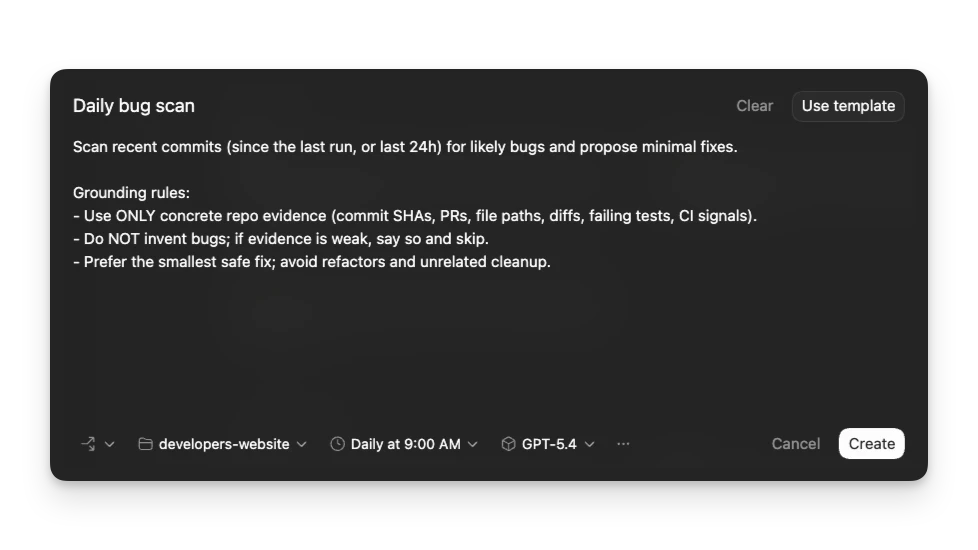
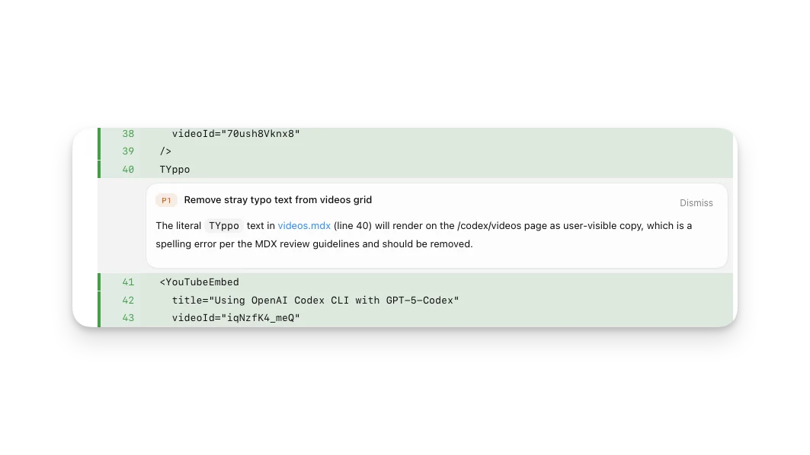
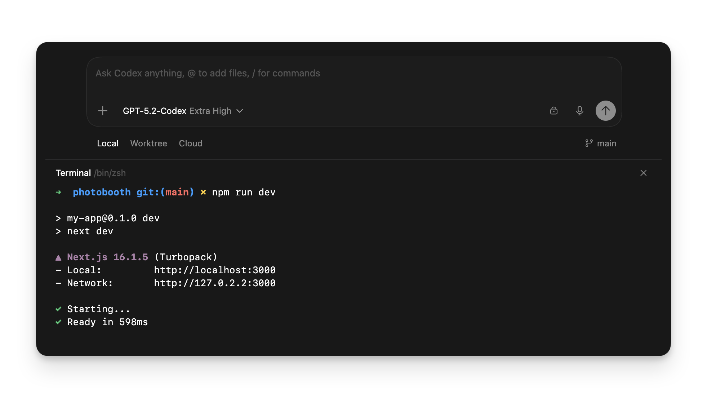
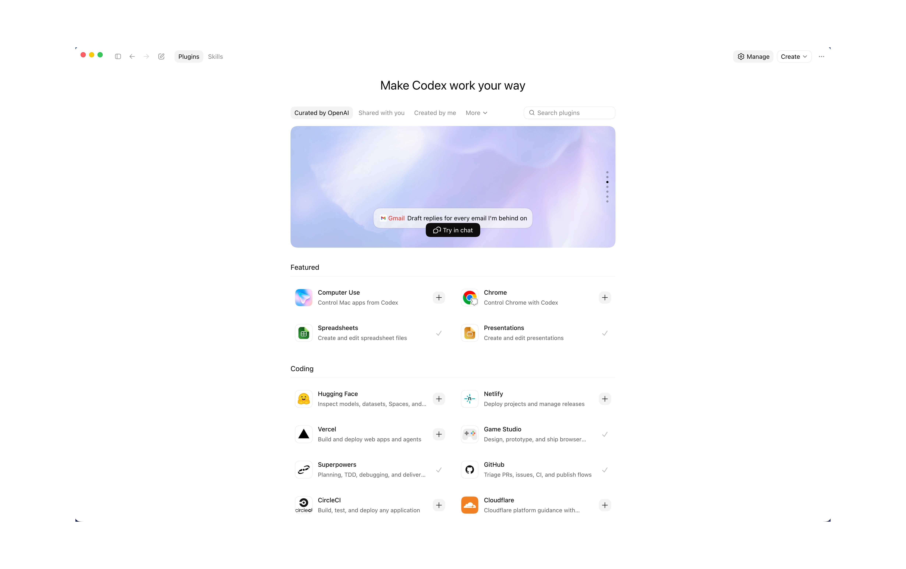
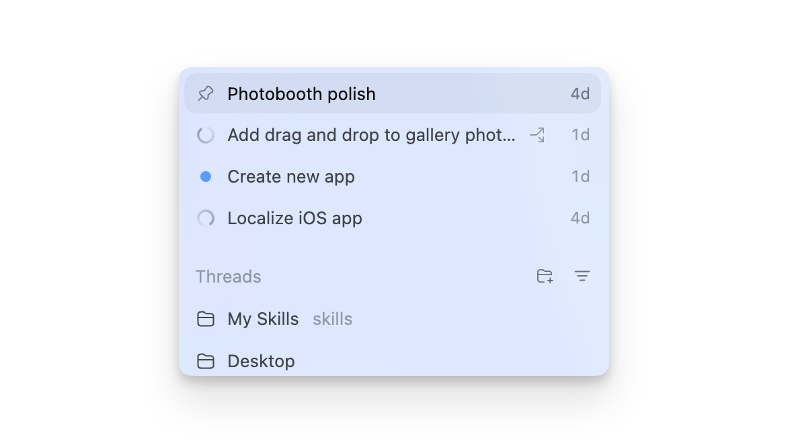
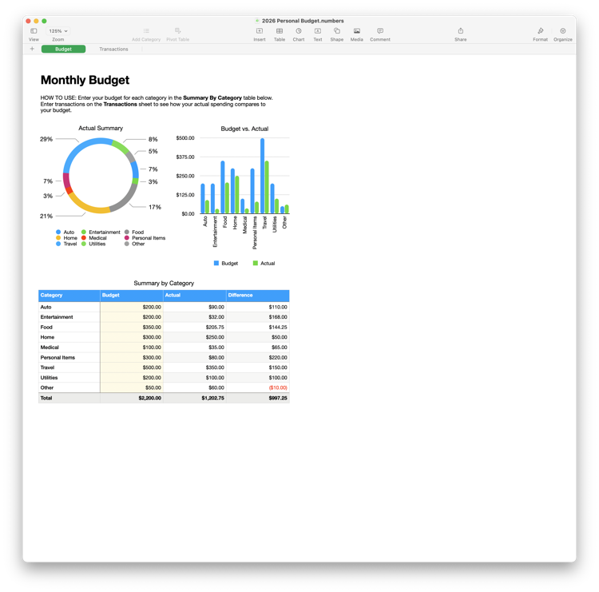
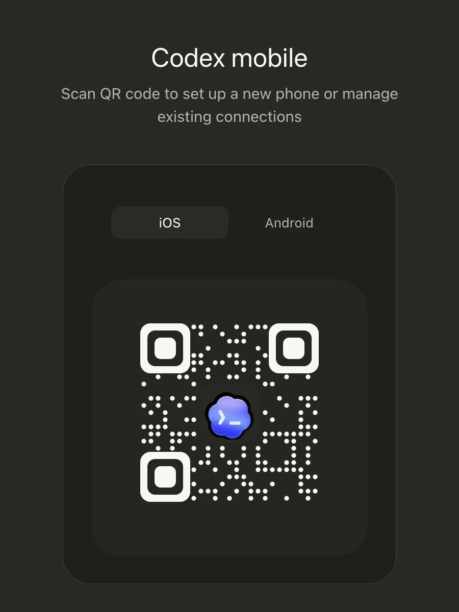
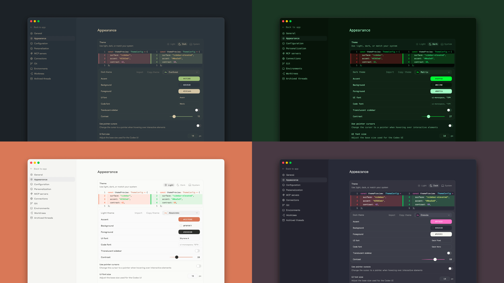

# Codex app feature research for Mcode

Researched on 2026-07-17 from OpenAI's current Codex manual and linked first-party product documentation. This note records documented behavior, then identifies the parts worth testing in the installed Windows app. Rollout-dependent behavior is not treated as locally confirmed.

## Product boundary

On 2026-07-09, OpenAI merged the standalone Codex app into the ChatGPT desktop app. Codex remains a coding experience beside Chat and Work, with existing projects retained. This note uses Codex app as shorthand for that experience. [OpenAI announcement](https://openai.com/index/chatgpt-for-your-most-ambitious-work/) [OpenAI: Codex changelog](https://learn.chatgpt.com/docs/changelog)

## Executive recommendation

Mcode should adapt the workflows to Codex, Claude, Cursor, Copilot, and OpenCode while keeping thread, worktree, review state, and evidence together.

The best near-term opportunities are:

1. Scheduled work with a run inbox and isolated worktrees.
2. Shareable project setup scripts and one-click actions.
3. Hunk-level stage, revert, and comment-to-fix controls in Review.
4. Full-text thread search plus find inside the open thread.
5. Inspect, steer, and stop controls for running sub-agents.
6. `mcode://` links that open a project, prefill a prompt, and select a work mode.
7. Bounded terminal-output context that an agent can inspect on request.

## Existing Mcode behavior to preserve

Several Codex behaviors already have an Mcode equivalent. They should not become duplicate parity tickets.

| Codex behavior | Existing Mcode signal | Useful extension |
| --- | --- | --- |
| Queue a follow-up while an agent runs | `queueStore` already supports bounded queues, editing, reordering, removal, and send-now behavior. | Add a separate steer action only if providers can support it consistently. |
| Search chats by project and branch metadata | `ThreadRepo.search` covers title, project, provider, branch, and worktree metadata. | Index message content and add find-in-thread. |
| Command palette and keyboard-first navigation | `PRODUCT.md` defines the command palette as a core surface. | Add deep-link discovery and editable shortcuts. |
| Worktree-isolated threads | Worktrees, branchless worktrees, existing-worktree reuse, and Create branch are part of the domain model. | Add snapshots and recovery around cleanup or deletion. |
| Browser preview with visual annotations | Preview annotations already carry a screenshot and structured page and target context. | Add style adjustment, console and network evidence, and a repeatable verify loop. |
| Pull request inbox and inline review drafts | The pull request review model already includes inline drafts and Review worktrees. | Connect a comment or hunk directly to an isolated fix thread. |
| Keep the machine awake during active work | The desktop main process already uses Electron's `powerSaveBlocker` while the server is busy. | Expose status or policy only if users need control. |

## Priority 0 opportunities

### 1. Scheduled work and a run inbox

Codex can run recurring tasks against a local project or an isolated worktree. Its Scheduled view separates active, paused, completed, unread, and recent runs. A task can start a fresh chat for each run or return to an existing chat with its context. Tasks can use skills and plugins, accept RRULE schedules, and run unattended under the configured sandbox policy. [OpenAI: Scheduled tasks](https://learn.chatgpt.com/docs/automations)

Mcode opportunity:

- Add an Automations surface with status, unread results, logs, diff, cost, provider, and worktree.
- Support standalone runs and recurring turns in one thread, with selectable provider, model, permissions, and fallback.
- Isolate code-changing runs in worktrees and require user action before commit, push, or pull request creation.
- Add stop rules for outcomes such as green CI, approval, or a budget limit.

### 2. Shareable project setup and actions

Codex local environments define setup scripts that run when a new worktree is created. They also define named actions, such as Run, Test, or Build, which appear in the app and execute in the integrated terminal. The configuration lives in the repository's `.codex` folder and can be shared with the team. [OpenAI: Local environments](https://learn.chatgpt.com/docs/environments/local-environment)

Mcode opportunity:

- Add a checked-in project manifest with OS-specific setup and named actions.
- Record worktree setup duration, exit code, and last successful revision.
- Surface actions in the thread header, command palette, automation editor, and human-run terminal.
- Publish discovered development-server URLs into Preview.

### 3. Hunk-level review controls and comment-to-fix

Codex's review pane can show unstaged, staged, commit, branch, and last-turn changes. It supports inline comments and stage, unstage, or revert operations at the full diff, file, and hunk levels. Pull request context and reviewer comments can appear beside the local diff. [OpenAI: Code review](https://learn.chatgpt.com/docs/code-review)

Mcode opportunity:

- Add stage, unstage, and revert at diff, file, and hunk scope, with confirmation for reverts.
- Send pending hunk comments as structured context to the current thread.
- Offer Review this hunk in a new worktree for risky or unrelated fixes.
- Preserve Last turn and All turns so agent and manual changes stay distinguishable.

### 4. Full-text conversation search and find-in-thread

Codex offers search across past chats and a separate find command inside the open chat. Expanded search can match chat content and Git branch names. [OpenAI: Desktop app commands](https://learn.chatgpt.com/docs/reference/commands)

Mcode opportunity:

- Index user messages, final responses, tool names, file paths, and branch names.
- Add find-in-thread with highlighted matches and surrounding transcript.
- Exclude internal prompts, secrets, raw tool payloads, and hidden messages.
- Filter by provider, project, date, outcome, and files changed.

### 5. Direct sub-agent controls

Codex surfaces each sub-agent thread for inspection. The documented workflow lets the user ask Codex to steer a running sub-agent, stop it, or close completed agent threads. The app also shows active and completed sub-agent state. [OpenAI: Subagents](https://learn.chatgpt.com/docs/agent-configuration/subagents)

Mcode opportunity:

- Open a focused activity view from each nested sub-agent row.
- Show parent task, provider, model, elapsed time, tools, and result.
- Add Steer, Interrupt, and Close where the provider supports them.
- Attribute approvals to their requesting sub-agent and hide unsupported controls.

### 6. Deep links into work

Codex registers `codex://` links for chats, settings, skills, scheduled tasks, plugins, and remote connections. New-chat links can prefill a prompt and resolve a workspace from an absolute path or Git remote URL. The prompt remains unsent so the user can review it. [OpenAI: Desktop app commands](https://learn.chatgpt.com/docs/reference/commands)

Mcode opportunity:

- Register `mcode://new` with bounded `prompt`, `path`, `originUrl`, `provider`, `mode`, and `baseBranch` parameters.
- Link to threads, projects, Review comparisons, pull requests, skills, plugins, and automations.
- Preview external links before creating worktrees or sending prompts.
- Reject unknown parameters, relative paths, oversized prompts, and untrusted targets.

### 7. Terminal output as bounded agent context

Each Codex chat has a project- or worktree-scoped terminal. The documentation says Codex can read the current terminal output, including a running development server or failed build. [OpenAI: Integrated terminal](https://learn.chatgpt.com/docs/integrated-terminal)

Mcode opportunity:

- Add Attach recent output and Watch this terminal actions.
- Send a bounded tail with shell, directory, command boundary, exit status, and truncation markers.
- Let the user select one shell and keep output out of context until requested.

## Priority 1 opportunities

### 8. A closed visual QA loop

Codex's built-in browser combines page preview, element or region comments, screenshot capture, style adjustment, and optional Chrome DevTools Protocol access for DOM, console, network, and performance diagnosis. Computer Use can then click, type, and verify the rendered result. [OpenAI: Browser](https://learn.chatgpt.com/docs/browser)

Mcode opportunity:

- Add structured spacing, typography, color, and layout adjustments to the existing Annotation bundle.
- Attach bounded console errors, failed requests, DOM target data, and a before screenshot.
- Rerun the saved state after changes and capture the result in one verification receipt.

### 9. Worktree snapshots and recovery

Codex can move a chat between Local and its associated worktree, copy selected ignored files through `.worktreeinclude`, retain permanent worktrees, and snapshot a managed worktree before automatic deletion so it can be restored. The documented default keeps the 15 most recent managed worktrees. [OpenAI: Worktrees](https://learn.chatgpt.com/docs/environments/git-worktrees)

Mcode opportunity:

- Preserve Mcode's persistent, manually managed worktrees.
- Before deletion, save a bounded manifest and patch for tracked and untracked non-secret files.
- Show storage, last activity, branch state, and recoverability before cleanup.
- Restore missing worktrees and allowlist ignored setup files for new ones.

### 10. Reviewable cross-thread memory

Codex local memories are opt-in and separate from ChatGPT web memory. Codex generates them after eligible chats become idle, stores them under the Codex home directory, provides per-chat controls for using or contributing memory, and documents secret redaction and rate-limit guards. The feature is off by default. [OpenAI: Memories](https://learn.chatgpt.com/docs/customization/memories)

Mcode opportunity:

- Link candidate memories to their source thread and evidence turn.
- Require review before durable or cross-provider use.
- Separate preferences, project facts, commands, and temporary observations.
- Show injected memories with exclude and delete controls; keep required rules in repository docs.

### 11. Dictation with an editable transcript

Codex exposes speech dictation from the desktop app and a keyboard shortcut for it. [OpenAI: Best practices](https://learn.chatgpt.com/guides/best-practices) [OpenAI: Desktop app commands](https://learn.chatgpt.com/docs/reference/commands)

Mcode opportunity:

- Add hold-to-dictate and toggle-to-dictate in the composer.
- Insert an editable, unsent transcript and correct known code identifiers and paths.
- Keep audio ephemeral unless explicitly saved.

### 12. Return-to-work affordances

Codex supports completion notifications, context-aware suggested prompts, archived-chat recovery, a detached chat window, and Always on top. It also exposes usage insights in the profile. [OpenAI: Desktop app settings](https://learn.chatgpt.com/docs/reference/settings)

Mcode opportunity:

- Notify on completion, approval needed, failure, CI change, review request, and scheduled-run findings.
- Build Resume suggestions from thread recap, git state, queued messages, and unresolved review comments.
- Add a compact always-on-top thread window for monitoring one running task.
- Keep social profile mechanics out of scope; show operational usage and cost insights instead.

### 13. Plugin installation that resumes the task

A Codex deep link can open a plugin-backed chat with an encoded plugin mention. If the plugin is available but missing, the app can install and connect it, then continue the same chat. The prompt is still user-submitted. [OpenAI: Desktop app commands](https://learn.chatgpt.com/docs/reference/commands)

Mcode opportunity:

- Explain the missing plugin and requested permissions in context.
- Preserve draft, attachments, provider settings, and worktree during installation.
- Resume at the blocked step, keeping skill, plugin, MCP server, and provider distinct.

### 14. Direct editing beside agent patches

OpenAI's 2026-07-09 release added code and Markdown editing, selected-content revision, inline annotations, and in-place patch review to the desktop app. It also introduced PR Chat for questions, feedback, proposed patches, and accept or reject decisions. [OpenAI announcement](https://openai.com/index/chatgpt-for-your-most-ambitious-work/) [OpenAI: Codex changelog](https://learn.chatgpt.com/docs/changelog)

Mcode opportunity:

- Add a focused hunk or file editor inside Review.
- Preserve the source comparison and identify manual edits separately from agent turns.
- Open PR comments as editable patch proposals that users can accept, reject, or send to an agent.
- Recompute Review after save without losing comments or scroll position.

### 15. File and artifact workspace

The desktop app can preview documents, spreadsheets, images, PDFs, Markdown, and generated files. Recent releases added sidebar previews, artifact cards, file tabs, file search, and direct editing. [OpenAI: Desktop app](https://learn.chatgpt.com/docs/app) [OpenAI: Codex changelog](https://learn.chatgpt.com/docs/changelog)

Mcode opportunity:

- Deliver the planned Files tab as project-scoped search and preview.
- Link files to the turns that created or changed them.
- Start with source, image, Markdown, PDF, and structured-data previews.
- Attach bounded selections and distinguish generated, tracked, ignored, and external files.

## Research tracks, not immediate implementation tickets

### 16. Multi-repository projects

The current desktop release supports multiple repositories in one project, but OpenAI's public announcement does not define combined diff behavior, branch ownership, worktree rules, or cross-repository commit and pull request flows. [OpenAI announcement](https://openai.com/index/chatgpt-for-your-most-ambitious-work/)

Potential Mcode use: a portfolio project that groups several existing workspaces for one task while preserving a separate checkout, permission boundary, diff, and commit history for each repository. This conflicts with the current one-workspace-to-one-folder domain rule and needs a domain design before implementation.

### 17. Mobile Remote, SSH, and host handoff

Codex Mobile Remote can start or continue work on a paired Windows or Mac host, send follow-ups, answer questions, approve actions, and inspect diffs, terminal output, tests, and screenshots. The desktop app can also discover SSH aliases and hand a chat and its Git state to a matching project on another host. [OpenAI: Remote connections](https://learn.chatgpt.com/docs/remote-connections) [OpenAI: Codex changelog](https://learn.chatgpt.com/docs/changelog)

Potential Mcode use: a read-first remote companion for monitoring threads, answering plan questions, reviewing diffs, and approving a bounded request. Remote shell and Git-state handoff need separate authentication, encryption, host identity, and recovery designs.

### 18. Computer Use

Codex Computer Use can operate Windows and macOS graphical apps, take screenshots, and work across applications. On Windows it takes over the foreground desktop. It maintains app-specific allow decisions and cannot control terminal apps, automate ChatGPT itself, approve administrator prompts, or grant security permissions. [OpenAI: Computer Use](https://learn.chatgpt.com/docs/computer-use)

Potential Mcode use: live verification of Electron, desktop, simulator, and browser flows. This needs a separate security design covering app allowlists, prompt injection, screenshots, clipboard access, cancellation, and visible audit receipts. A structured plugin or test API should remain the default when one exists.

### 19. Record a workflow into a skill

Codex Record & Replay watches a demonstrated macOS workflow and drafts a reusable skill with inputs, steps, and verification. It can combine Computer Use, browser actions, and plugins. The documented release is unavailable on Windows and initially excludes the United Kingdom, EEA, and Switzerland. [OpenAI: Record & Replay](https://learn.chatgpt.com/docs/extend/record-and-replay)

Potential Mcode use: record a verification or release procedure, then convert it into a provider-neutral skill. Research should begin with a deterministic browser or terminal recording before broad desktop capture.

### 20. Frontmost-window capture

Codex Appshots can attach the frontmost macOS window as an image plus accessible text, including text exposed outside the visible scroll area. It can append consecutive captures to a recent chat. [OpenAI: Appshots](https://learn.chatgpt.com/docs/appshots)

Potential Mcode use: a cross-platform Capture window action that places a reviewed screenshot and bounded accessible text into the composer. The user should see the complete payload before sending it.

## Hands-on verification checklist

The documentation establishes product intent, not the exact behavior of the installed build. Verify these points with the Windows Codex app before turning the research tracks into implementation briefs:

1. Which features appear for the signed-in account under Codex rather than Work mode.
2. Whether a queued message can be edited, reordered, sent early, deleted, and switched to steer from the composer.
3. How scheduled-run failures, retries, missed schedules, worktree reuse, and approvals appear.
4. Whether Codex reads terminal output automatically or only after an explicit request.
5. How mixed staged and unstaged hunks render, and what confirmation appears before revert.
6. Whether browser comments include DOM context and style values or only prose and screenshots.
7. Which sub-agent controls are visible buttons and which require a natural-language instruction.
8. How invalid or malicious `codex://` parameters are rejected.
9. What a chat-level memory control shows about the memories used or generated.
10. Which Browser, Computer Use, Scheduled, and memory features are hidden behind rollout, plan, region, or workspace policy.
11. How multiple repositories are added, permissioned, diffed, branched, and committed inside one project.
12. How direct editor autosave, undo, patch proposals, stale diffs, and concurrent agent changes behave.
13. How Mobile Remote reconnects, attributes approvals, streams terminal output, and handles host loss.

Appshots and Record & Replay cannot be verified in the current Windows and United Kingdom environment under the documented availability rules.

## Official screenshot evidence

These first-party screenshots preserve the visible reference state used during the audit. They are product evidence, not Mcode mockups.

| Workflow | Screenshot | Source |
| --- | --- | --- |
| Scheduled work in an isolated worktree |  | [Scheduled tasks](https://learn.chatgpt.com/docs/automations) |
| Inline code review finding |  | [Code review](https://learn.chatgpt.com/docs/code-review) |
| Project-scoped terminal |  | [Integrated terminal](https://learn.chatgpt.com/docs/integrated-terminal) |
| Plugin discovery and installation |  | [Plugins](https://learn.chatgpt.com/docs/plugins) |
| Parallel project work |  | [Codex app](https://learn.chatgpt.com/docs/app) |
| Frontmost-window context capture |  | [Appshots](https://learn.chatgpt.com/docs/appshots) |
| Mobile host pairing |  | [Remote connections](https://learn.chatgpt.com/docs/remote-connections) |
| Custom theme comparison |  | [Desktop app settings](https://learn.chatgpt.com/docs/reference/settings) |
| Memory documentation reference |  | [Memories](https://learn.chatgpt.com/docs/customization/memories) |
| Record and Replay documentation reference |  | [Record and Replay](https://learn.chatgpt.com/docs/extend/record-and-replay) |

## Source notes

The Codex manual was fetched through OpenAI's official Codex documentation helper on 2026-07-17 and reported current. All external links in this note point to first-party OpenAI product documentation. The Mcode comparison is a focused repository scan, not a complete implementation audit.
