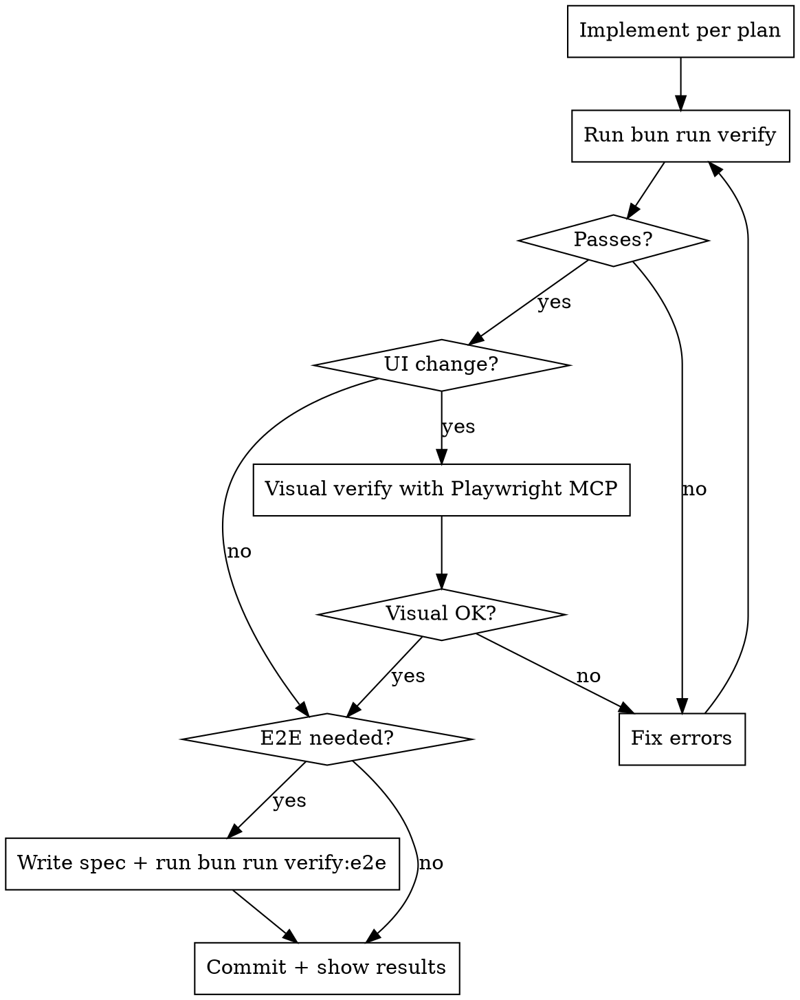

# Agent Workflow

Mandatory workflow for autonomous code implementation. Stop hooks enforce
verification; you cannot finish a turn with failing checks.

## Workflow



## Verify (mandatory, enforced)

```bash
bun run verify
```

Runs typecheck, lint, and unit tests. All three must pass with zero errors.
The Stop hook runs this automatically when you try to finish a turn. If it
fails, you get the error output and must fix before you can stop.

Do not run `tsc --noEmit` or test commands individually. Use `bun run verify`.

**Test scope.** `bun run verify` runs the full unit-test gate whenever
verification runs (it still skips entirely when no code changes are detected).
The Stop hook calls `verify-tests.mjs` directly without `--full`, so it scopes
each workspace's vitest run to tests related to the changed files
(`vitest related <files> --run`) for fast feedback. Any change inside
`packages/contracts` or `packages/shared` falls back to the full suite because
those packages are imported across the repo and vitest's related-file import
graph is per-project.

## Visual Verify (when UI changes + Playwright MCP available)

If Playwright MCP is connected and the change affects UI:

| Step | Tool | Purpose |
|------|------|---------|
| 1 | Check `localhost:5173` is up (or run `bun run dev:web`) | Dev server |
| 2 | `browser_navigate` | Open affected page |
| 3 | `browser_snapshot` | Read accessibility tree |
| 4 | `browser_take_screenshot` | Capture visual state |
| 5 | `browser_console_messages` | Check for errors |

If visual issues found, fix and re-run `bun run verify` before retrying.

If Playwright MCP is not connected, skip and note it.

## E2E Tests

Write E2E tests when the change involves any of these triggers:
interactive components, keyboard navigation, focus trapping, responsive
layout, accessibility semantics, floating overlays, or persisted state.

"If applicable" is not a loophole. A dropdown with keyboard navigation
needs an E2E spec. A color change does not. When in doubt, write the spec.

1. Write a Playwright spec in `apps/web/e2e/`
2. Run `bun run verify:e2e`
3. Fix any failures

## Deliver

Commit with a conventional commit message. Show `bun run verify` output as
evidence that checks passed.

## Before You Declare Done

- [ ] `bun run verify` passes
- [ ] UI changes verified visually (if Playwright MCP available)
- [ ] E2E tests pass (if applicable)
- [ ] No browser console errors on affected pages

## Enforcement

| Agent | Config | Block mechanism |
|-------|--------|-----------------|
| Claude Code | `.claude/settings.json` | exit code 2 |
| Cursor | `.cursor/hooks.json` | exit code 2 via `scripts/agent/hooks/cursor-stop.mjs` |
| Codex | `.codex/hooks.json` | JSON `{"decision":"block"}` via `scripts/agent/hooks/codex-stop.mjs` |

PreToolUse hooks also block direct `.env` file edits across all agents.

## Playwright MCP

- **Claude Code:** reads `.mcp.json` automatically
- **Cursor:** reads `.cursor/mcp.json` automatically
- **Other agents:** run `npx @playwright/mcp@latest` and connect via MCP

## One-time cleanup

After the first per-build nightly release lands, run:

```bash
GH_TOKEN=$(gh auth token) node scripts/agent/one-time-cleanup-rolling-nightly.mjs --confirm
```

This deletes the legacy rolling `nightly` release (49 stale assets) and its tag. Clients on the nightly channel auto-rediscover via `allowPrerelease`.
