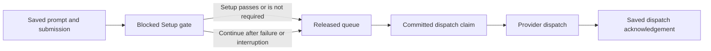

# Project environment commands

Project environment commands prepare a checkout through **Setup** or run a
named **Action** in that checkout. The server owns command resolution, approval,
process lifetime, and retained results. Provider turns use a separate lifecycle.

## Configuration scope and command approval

The selected storage mode determines one source of configuration. In system
mode, all checkouts of a Project use `projects/<workspace-id>/environment.json`
under Mcode's local data directory. In shared mode, each Thread reads
`.mcode/environment.json` from its own checkout. A worktree does not fall back
to the main checkout's shared file. This lets a branch change its commands
without silently running commands from another checkout.

Changing storage mode selects the document at that location. It does not merge
or copy documents. The [environment service](../../../apps/server/src/features/projects/environment/workspace-environment-service.ts#L572)
owns that choice, [checkout path resolution](../../../apps/server/src/features/projects/environment/workspace-environment-service.ts#L714),
validation, and revision-checked atomic saves.

Shared files can arrive through repository changes, so a shared command needs
approval for its resolved launch. Approval is scoped to the Project and command
identity, either Setup or a specific Action. Its
[fingerprint](../../../apps/server/src/features/projects/environment/workspace-environment-service.ts#L2112)
also includes the operating system, the terminal executable, and the script
and arguments with normalized line endings. Approval does not authorize every
command in a checkout. Identical launch facts can reuse a Project approval
across checkouts.

Approval re-resolves the current document and terminal command before it saves
the fingerprint. If the reviewed fingerprint no longer matches, approval fails
as stale. Starting a command also resolves current configuration. For Actions,
the [terminal backend](../../../apps/server/src/features/terminal/backends/terminal-backend.ts#L73)
checks the expected executable and arguments again before spawn. A changed
terminal profile therefore cannot execute under an approval for an older
launch. The [Action resolution](../../../apps/server/src/features/projects/environment/project-action-resolution.ts)
and [launch failure handling](../../../apps/server/src/features/projects/environment/project-action-service.ts#L255)
return renewed approval work when that mismatch requires another review.

## The Setup gate is separate from its attempts

Automatic Setup holds the first prompt for a managed New worktree before the
provider starts. The [automatic Setup store](../../../apps/server/src/features/projects/environment/workspace-environment-automatic-store.ts#L115)
atomically saves the visible user message, the queued submission, and a blocked
gate. The [environment service](../../../apps/server/src/features/projects/environment/workspace-environment-service.ts#L368)
starts Setup only after that admission commits.

The gate answers whether queued prompts may start. An attempt records what
happened to one Setup command. A passed attempt releases the gate. No applicable
Setup script releases it as not required. A failed or interrupted attempt keeps
it blocked until the user retries or continues. **Continue** releases queued
prompts without changing the failed attempt into a pass. **Retry** resolves the
current configuration and creates another attempt.

Gate release and provider dispatch are separate commits. The
[queue drain](../../../apps/server/src/features/projects/environment/workspace-environment-service.ts#L1678)
claims a released submission durably before dispatch. It marks the claim
dispatched after the dispatcher accepts it, then waits for that provider turn
to complete before claiming the next released prompt. Queue order comes from
durable admission order rather than timestamps.

If dispatch throws, the claim remains unacknowledged. Reconciliation does not
automatically replay that claim because the provider may already have accepted
the prompt. Avoiding repeated command effects takes precedence over guessing
whether an uncertain dispatch succeeded. At server startup,
[reconciliation](../../../apps/server/src/features/projects/environment/workspace-environment-service.ts#L552)
marks unfinished Setup attempts interrupted and drains committed releases. It
does not automatically rerun the interrupted Setup command.

Manual Setup runs in Direct mode or an unmanaged existing worktree. Its latest
attempt is transient server state, and it does not start a provider turn. The
[manual admission guard](../../../apps/server/src/features/projects/environment/workspace-environment-service.ts#L1916)
keeps managed worktrees on the automatic gate path.

## Cancellation must settle owned commands

Cancelling a queued prompt removes only that prompt and its stored attachments.
It does not stop Setup. **Stop** interrupts automatic Setup but leaves its gate
blocked. Opening a recovery terminal also leaves the gate unchanged. These
operations cannot imply permission to dispatch queued prompts.

A finished attempt does not prove that its process resources have been
released. [Stop and Retry](../../../apps/server/src/features/projects/environment/workspace-environment-service.ts#L440)
coordinate pending preparation and command closure. Containment failure keeps
command ownership until release is confirmed, so Retry cannot start a
replacement while an older command may still run.

Thread and Project deletion block new Setup and Action starts before cleanup.
Automatic Setup and Action teardown wait for admitted work to settle and close
owned commands. Manual Setup cancellation bounds its wait for pending
preparation but retains the cancellation check. The service closes a command
prepared later without starting it. The
[Setup cancellation checks](../../../apps/server/src/features/projects/environment/workspace-environment-service.ts#L1046)
and [Action admission gate](../../../apps/server/src/features/projects/environment/project-action-admission.ts)
prevent a delayed configuration read from launching work after teardown starts.

## Actions retain results beyond process exit

An Action owns an attachable terminal record in the Thread's checkout. Its
command runs through the Project profile's noninteractive launch, then a fresh
interactive shell opens in the same record and folder. Stop interrupts the
command and leaves that shell open. Restart creates a new run in the same
terminal. Closing the terminal interrupts a command still running and clears
the run's terminal identity.

The [Action service](../../../apps/server/src/features/projects/environment/project-action-service.ts)
reserves one slot per Thread and Action before resolution. Starting an Action
whose terminal is already open returns its retained run. Pending approval,
running and exited terminals all count toward the eight-record scope limit.

The terminal replay includes a synthesized command echo and both processes'
output. The retained transcript temporarily feeds the existing Action view and
contains only command-process output. Output persistence does not publish run
updates; publication follows lifecycle changes.

The initial running result must be saved before the service subscribes to
output and exit events. If retention fails after launch, the
[launch compensation](../../../apps/server/src/features/projects/environment/project-action-launch-compensation.ts)
stops the launched command and preserves the original failure. A cleanup
failure preserves both errors rather than reporting a successful start.

Process exit also has a persistence barrier. The
[run lifecycle](../../../apps/server/src/features/projects/environment/project-action-run-lifecycle.ts#L33)
waits for pending output writes and saves the final result before releasing the
slot. If that save fails, the slot remains pending finalization. Stop or Restart
can retry the save, but another Start cannot overtake it. Run identity checks
ignore late output and exit events from a replaced session.

Startup reaps stale terminals before it marks persisted running Action results
interrupted. During shutdown, [server composition](../../../apps/server/src/application/bootstrap/server-bootstrap.ts#L990)
disposes Actions and Setup before shutting down their terminal dependency. A
retained run result is evidence of the command lifecycle, not permission to
resume or replay the command.
