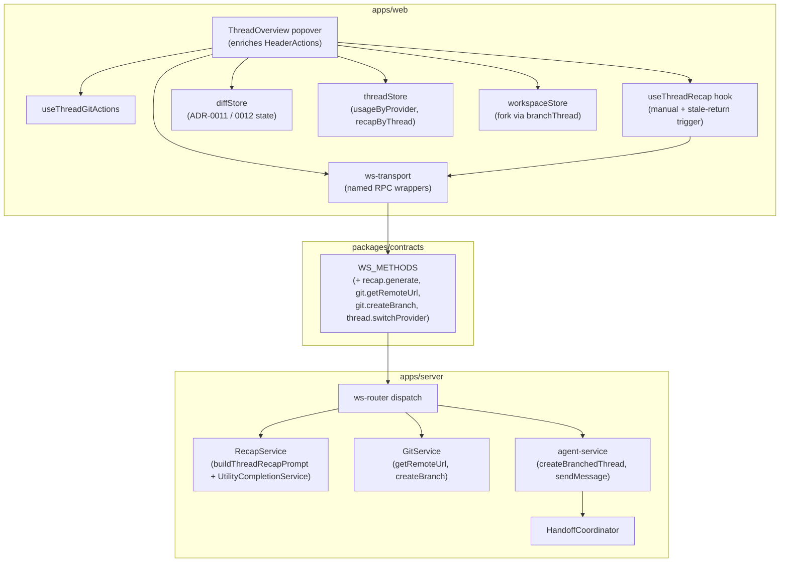
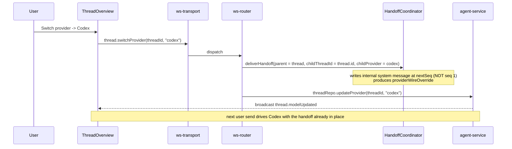
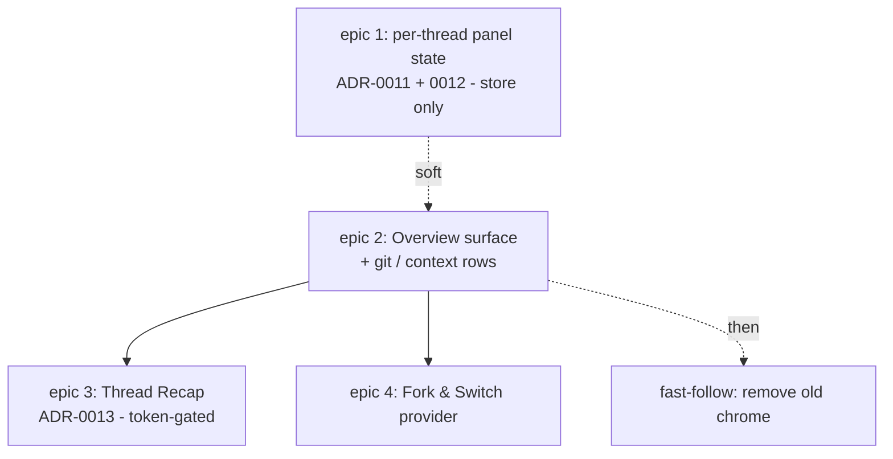

# Thread Overview

**Date:** 2026-06-16
**Status:** Design
**Related ADRs:** [0011](../adr/0011-review-default-view-per-thread.md) (Review default view per thread), [0012](../adr/0012-right-panel-state-per-thread.md) (right-panel state per thread), [0013](../adr/0013-thread-recap-generation-and-caching.md) (thread recap generation and caching)
**Related specs:** [2026-04-14](2026-04-14-usage-tracking-design.md) (usage tracking), [2026-04-22](2026-04-22-dynamic-context-window-design.md) (dynamic context window)
**Reference implementation:** Synara (github.com/Emanuele-web04/synara), a diverged sibling fork that already shipped the Recap. Adapt, do not cherry-pick.
**Epics:** #753 (per-thread panel state), #754 (Overview surface), #755 (Thread Recap), #756 (Fork & Switch provider). Sub-issues #757-#776.

This is the shared architectural backbone for four epics. It pins the system shape, the new RPC contracts, the store changes, and the cross-cutting data flows once, so each epic's PRD and issues reference one consistent design. It does not restate the product rationale already grilled into `CONTEXT.md` (Overview, Recap, Fork, Switch provider, Create branch) or the trade-offs already settled in ADRs 0011 / 0012 / 0013.

## Problem

A thread's working context is scattered across the header. The current `header-workspace-menu` is a thin dropdown (Changes, Branch, Commit-or-push, Create PR) that answers "what git actions can I take" but not "what is this thread, where does its code live, how much budget is left, and how do I take it further." A user mid-thread cannot see, in one place: a plain-language recap of what the thread is doing, the repository it targets, the worktree and branch it runs on, its provider usage, and the full set of ways to continue (commit, PR, fork, switch provider, branch). Codex's Environment panel solves this for its world; mcode has no equivalent thread-scoped surface.

## Solution

Enrich the existing `header-workspace-menu` into a thread-scoped header popover, **Overview** (code symbol `ThreadOverview`). It recaps the active thread's working context and hosts its git and continuation actions as a vertical list of rows:

| Row | Shows | Action | Backing |
|-----|-------|--------|---------|
| **Recap** | AI one-line "what you're working on" | manual refresh | new `recap.generate` RPC, in-memory cache (ADR-0013) |
| **Changes** | changed-file count | opens Review tab | existing `changes.toggle`; lands on the ADR-0011 per-thread default |
| **Repository** | `org/repo` (or folder name) | opens the remote in the browser | new `git.getRemoteUrl` RPC |
| **PR** | live PR status + CI | commit-or-push, create PR, open PR | reuse `PrSplitButton` / `ChecksPopover` / `useThreadGitActions` |
| **Mode** | worktree path + branch | copy branch | existing thread fields |
| **Usage** | active provider's quota / cost | none (display) | reuse `usageByProvider[thread.provider]` (no new fetch) |
| **Create branch** | current branch | `git checkout -b` in place | new `git.createBranch` RPC |
| **Fork** | new worktree / existing worktree / new local thread | spawns a child thread + handoff | reuse `agent.createAndSend` + `HandoffCoordinator` |
| **Switch provider** | provider list | swaps this thread's provider + handoff | new `thread.switchProvider` RPC |

A **CI notification blob** on the trigger (red = failing, green = passing, nothing otherwise) is scoped to the active thread and visible without opening the popover.
### Layout

At a chat-pane width of 824px or more, Overview opens beside the thread and the chat reserves room for its 320px popover and a 16px gap. At narrower widths, Overview stays closed until opened explicitly, then overlays the chat. The popover scrolls within the height available below its trigger.

### Goals

- One thread-scoped surface for context recap plus every continuation action.
- Reuse before rebuild: the PR stack, the usage slice, the fork flow, and the handoff coordinator already exist. Three small read RPCs (`recap.generate`, `git.getRemoteUrl`, `git.createBranch`) and one orchestration RPC (`thread.switchProvider`) are the only net-new server contracts.
- Keep the cost of the Recap near zero (ADR-0013).

### Non-goals

- Removing the now-redundant chrome (header project/workspace badge, composer status bar). Deferred to a fast-follow once the Overview proves itself.
- A "Send to cloud" action or a "Sources" row. Out of scope.
- Implementing `getUsage` for providers that lack it (Codex, Cursor). The Usage row degrades gracefully (see below); these are a clean later add.

## System architecture



The Overview is a presentation surface over data that already flows. The only new server work is the three read RPCs, the `RecapService`, the two `GitService` methods, and the `thread.switchProvider` orchestration.

## New RPC contracts

All four follow the canonical `diffSummary.*` idiom: an entry inside the `WS_METHODS` `lazySchema` factory (no per-entry `lazySchema` wrapping), a `case` in `ws-router`'s dispatch switch reading injected `RouterDeps`, and a named typed wrapper on the client transport object (callers use `getTransport().generateRecap(...)`, never a generic string dispatch).

### `recap.generate`

Stateless. The client owns the trigger and assembles bounded material; the server revalidates those bounds, builds the prompt, runs the utility model, and **stores nothing** (ADR-0013).

```ts
"recap.generate": {
  params: z.object({
    threadId: z.string(),                 // telemetry only; server reads no repo
    messages: z.array(z.object({          // client-selected: first-pass window or delta
      role: z.enum(["user", "assistant"]),
      content: z.string(),
    })),
    previousRecap: z.string().nullable(),
  }),
  result: z.object({ text: z.string() }),
}
```

Server: a `RecapService` with a pure `buildThreadRecapPrompt(messages, previousRecap)` and `sanitizeThreadRecap(text)` (mirroring `buildDiffSummaryPrompt` and Synara's `textGenerationShared`), calling `UtilityCompletionService.complete` (our haiku utility model, low reasoning effort). The handler and prompt builder validate the message count, per-message content length, `previousRecap` length, and total prompt material before prompt assembly, rejecting oversized payloads early. The prompt instructs the model to return the previous recap unchanged when nothing material changed. Output clipped to ~220 chars.

### `git.getRemoteUrl`

```ts
"git.getRemoteUrl": {
  params: z.object({ path: z.string() }),
  result: z.object({
    webUrl: z.string().nullable(),  // normalized https, null when no remote
    label: z.string(),              // "org/repo" or folder-name fallback
  }),
}
```

Server: `GitService.getRemoteUrl(path)` runs `git -C <path> remote get-url origin`, normalizes SSH (`git@github.com:org/repo.git`) and `.git` suffixes to an https web URL, derives the `org/repo` label, and falls back to the directory basename with `webUrl: null` when there is no remote. Normalization lives server-side so it is validated once at the boundary and tested in one place.

### `git.createBranch`

```ts
"git.createBranch": {
  params: z.object({ path: z.string(), name: z.string() }),
  result: z.object({ branch: z.string() }),
}
```

Server: `GitService.createBranch(path, name)` runs `git -C <path> checkout -b <name>` (create plus checkout in one step) and returns the created branch. The name crosses a process boundary into a subprocess, so it is validated against a git-ref allowlist before the exec: reject empty, leading `-`, whitespace, `..`, and shell metacharacters. Fail closed.

### `thread.switchProvider`

Orchestration. Swaps the provider driving an existing thread (same id, history, worktree) and generates a handoff from the outgoing provider. See the dedicated section below for the mechanism and its hazard.

```ts
"thread.switchProvider": {
  params: z.object({
    threadId: z.string(),
    provider: ProviderIdSchema,
    model: z.string().optional(),
  }),
  result: z.object({ ok: z.boolean() }),
}
```

## Store and state changes

### Review default view per thread (ADR-0011)

`diffStore` gains per-thread Review view state plus a per-thread "user picked" override flag. `defaultReviewView` extends from the current 2-way (`thread` -> `last-turn`, `threadless` -> `unstaged`) to the 3-way change-state default: turn-registered changes -> Last turn; else dirty working tree -> Unstaged; else -> Branch. The default re-evaluates live until the user picks a view, after which the per-thread override sticks. Mechanism mirrors the existing `branchManuallySelected` guard. In-memory, dropped by `clearThread`.

### Right-panel container state per thread (ADR-0012)

All panel container state (visibility, width, active tab, open-tabs set) becomes per-thread, read through a copy-on-write accessor that falls back to a single workspace-level record until a thread writes its own entry. Supersedes ADR-0004's per-thread-visibility / workspace-global-width-and-tab split. `clearThread` drops the whole per-thread record.

### Recap cache (ADR-0013)

`threadStore` gains an in-memory `recapByThread` entry per thread containing the recap text, the covered conversation signature, the covered message id, and generation timestamps. The entry is never persisted and is dropped by `clearThread`. A `useThreadRecap` hook owns manual refresh and auto generation on stale-thread re-orientation. Re-orientation means app focus return, switching back to a thread, or opening the Overview. Auto generation requires enough user/assistant conversation to summarize, no running turn, a changed signature, and a last completed turn at least about five minutes old. Manual refresh bypasses the stale-time threshold and the same-signature cache gate, but still dedupes in-flight requests. After the first recap, generation sends only the delta since `coveredMessageId` plus the previous recap. The hook is an opt-in side effect of re-orientation or row action and never runs from the transcript render or turn-event path.

### Usage row (reuse, no new fetch)

The Usage row reads `usageByProvider[thread.provider]` from the active thread record, already populated by `fetchProviderUsage` (on `session.usageUpdated` and on thread/provider switch) per the usage-tracking spec. It renders the same `ProviderUsageInfo` shape (`quotaCategories`, `sessionCostUsd`, `serviceTier`, `numTurns`, `durationMs`) the sidebar panel renders. For providers without `getUsage` (Codex, Cursor) the router already returns `{ providerId, quotaCategories: [] }`, so the row shows "usage unavailable" with no new code.

## Data flows

### Recap generation trigger

```mermaid
sequenceDiagram
    participant U as User
    participant P as ThreadOverview (open)
    participant H as useThreadRecap
    participant T as ws-transport
    participant R as RecapService
    U->>P: opens Overview or returns to thread
    P->>H: re-orientation event
    H->>H: compute signature
    alt matching request already in flight
        H-->>P: keep pending state
    else auto request and signature unchanged or matches cache/last-failed
        H-->>P: render cached recap or quiet unavailable state
    else manual request or auto-eligible stale thread
        H->>H: assemble bounded delta + previousRecap
        H->>T: recap.generate(threadId, messages, previousRecap)
        T->>R: dispatch
        R->>R: buildThreadRecapPrompt -> UtilityCompletionService -> sanitize
        R-->>H: { text }
        H->>H: write recapByThread[threadId]
        H-->>P: render recap
    end
    Note over H: auto waits for >= 5m since last completed turn;<br/>manual bypasses stale time and same-signature cache reuse
```

### Cross-provider switch



### Fork (reuses existing flow)

Fork is already wired: `agent.createAndSend` with `parentThreadId` (and optional `forkedFromMessageId`) creates a child thread in the chosen mode (worktree / existing-worktree / direct), then `HandoffCoordinator.deliverHandoff` attaches the handoff to the child's first send. The Overview's Fork group is a new entry point into this flow, not new flow. No server changes.

## The CI notification blob

A small status dot on the Overview trigger, derived purely from the active thread's PR checks already in `useThreadGitActions` (`checks`, `pr`):

```ts
function ciBlob(pr, checks): "red" | "green" | null {
  if (!pr || !checks) return null;          // no PR or no checks -> no dot
  if (checks.failing > 0) return "red";
  if (checks.allPassed) return "green";
  return null;                              // pending -> no dot
}
```

Scoped to the active thread only. It reuses the existing checks channel; it is a pure derivation with no new data source.

## Cross-provider switch: the seq-anchor hazard

The switch is **already half-wired**. `thread.provider` is mutable (`threadRepo.updateProvider`), and `agent.send` already accepts an optional `provider` that, when explicitly passed, re-persists the provider and broadcasts `thread.modelUpdated`. What is missing is the handoff from the outgoing provider on an in-place switch: the `HandoffCoordinator` is only ever called from `createBranchedThread`.

The coordinator does not require a new thread - `deliverHandoff` accepts `childThreadId` and works when it equals the parent thread id. The one real hazard: the coordinator persists its internal handoff system message at a **hardcoded `seq = 1`**. On an existing thread with `nextSeq > 1`, that collides. Epic 4 must change the switch path to write the internal message at the thread's current `nextSeq`, not a constant `1`. This is the single structural change the switch requires beyond wiring the new RPC; everything else (provider update, broadcast, wire override) already exists. This is why the switch carries its own epic.

## Epic decomposition and dependency graph



| Epic | Delivers | New contracts | Depends on |
|------|----------|---------------|------------|
| 1 (#753) - per-thread panel state | ADR-0011 + ADR-0012 store changes | none | none |
| 2 (#754) - Overview surface + rows | `ThreadOverview` popover, Changes / Repository / Create branch / Mode / Usage / PR rows + CI blob | `git.getRemoteUrl`, `git.createBranch` | 1 (soft - Changes row works without it, just with the old default) |
| 3 (#755) - Thread Recap | `recap.generate` + cache + trigger hook + Recap row | `recap.generate` | 2 (hard - fills a row, needs the panel gate) |
| 4 (#756) - Fork & Switch provider | Fork group + cross-provider switch (+ the seq-anchor fix) | `thread.switchProvider` | 2 (hard - actions live in the shell) |

Epics 3 and 4 are parallel once 2 lands. The chrome-removal fast-follow is a follow-up to 2, not its own epic.

## Testing strategy

Test at the highest existing seam. Prior art and new seams, per area:

| Area | Seam | Prior art |
|------|------|-----------|
| `GitService.getRemoteUrl` / `createBranch` | mock-executor unit test; assert normalization, exec args, and the createBranch arg-injection guard | `git-service-push.test.ts` |
| Recap | pure `buildThreadRecapPrompt` / `sanitizeThreadRecap`; reuse the already-tested `UtilityCompletionService` | `diff-summary-prompt.test.ts`, `utility-completion-service.test.ts` |
| ADR-0011 default | extend `defaultReviewView` + per-thread override + `clearThread` cleanup | `review-views.test.ts`, `diffStore.test.ts` |
| ADR-0012 panel state | copy-on-write fallback accessor | `diffStore.test.ts` `getRightPanelVisible` cases |
| Recap scheduling | pure `shouldScheduleThreadRecapGeneration` + signature hash + auto cap | Synara `threadRecap.ts`; Claude Code session recap behavior for manual and away-return prior art |
| CI blob | pure `(pr, checks) -> "red" \| "green" \| null` | new, trivial |
| Overview popover | extend `chat-header-consolidated.spec.ts` (drives `header-workspace-menu`); follow `sidebar-usage-popover.spec.ts` mechanics | both exist |

The RPC handlers stay thin pass-throughs and are not separately unit-tested - consistent with `diffSummary.*` and `handoff.*`, whose logic lives in tested builders and services, not their router cases.

## Security and defensive considerations

- **`git.createBranch` name** crosses into a subprocess. Validate against a git-ref allowlist (reject empty, leading `-`, whitespace, `..`, shell metacharacters) before exec. Fail closed.
- **`git.getRemoteUrl`** normalizes an externally-controlled git config value. Normalize once at the boundary; return `null` rather than a half-parsed URL when the remote is malformed or absent.
- **`recap.generate` input** is bounded by the client (first pass ~6 messages, ~600 chars each, delta ~4 messages) and revalidated on the server before prompt assembly. The server rejects oversized payloads and clips output to ~220 chars. The utility model runs at low reasoning effort. Auto generation is capped per thread and signature so repeated thread switching cannot create hidden spend. No unbounded retention: the recap cache is in-memory and per-thread.
- **`thread.switchProvider` seq anchor**: write the internal handoff message at `nextSeq`, never a constant, to avoid a primary-key collision on a non-empty thread.

## Deferred and out of scope

- **Chrome removal** (header badge, composer status bar) - fast-follow after the Overview ships.
- **`getUsage` for Codex / Cursor** - the Usage row degrades gracefully; implement later.
- **Persisting the Recap, the Review override, or the panel state across restarts** - all intentionally in-memory (ADRs 0011 / 0012 / 0013); revisit only if the reset grates.
- **Send to cloud, Sources** - not part of this surface.

## Files touched (by epic, indicative)

| Epic | Package | Area |
|------|---------|------|
| 1 | `apps/web` | `diffStore`, `review-views`, `DiffToolbar` |
| 2 | `packages/contracts` | `ws/methods.ts` (`git.getRemoteUrl`, `git.createBranch`) |
| 2 | `apps/server` | `git-service.ts`, `ws-router.ts` |
| 2 | `apps/web` | `HeaderActions.tsx` -> `ThreadOverview`, `useThreadGitActions`, `ws-transport` |
| 3 | `packages/contracts` | `ws/methods.ts` (`recap.generate`) |
| 3 | `apps/server` | new `RecapService` + prompt builder, `ws-router.ts` |
| 3 | `apps/web` | `threadStore` (`recapByThread`), new `useThreadRecap` hook, Recap row |
| 4 | `packages/contracts` | `ws/methods.ts` (`thread.switchProvider`) |
| 4 | `apps/server` | `ws-router.ts`, `HandoffCoordinator` (seq anchor), `agent-service` |
| 4 | `apps/web` | Fork group + Switch provider in `ThreadOverview`, `ws-transport` |

File paths are indicative and may drift; the contracts, store shapes, and flows above are the durable part.
